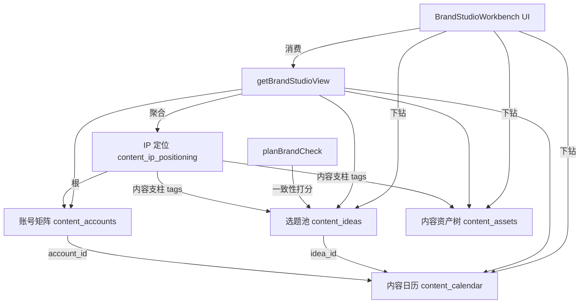

## 用户需求

用户是专业个人 IP 打造团队,要求把现有 Brand Studio 从「单账号排期工作台」升级为**个人 IP 全生命周期作战全景图**——以 IP 定位为根,贯穿「人设内核 → 内容支柱 → 账号矩阵分工 → 选题/脚本/资产 → 跨账号排期 → 数据看板与一致性巡检」,做成 IP 操盘团队可指挥作战的驾驶舱。

## 产品概述

一套面向 IP 操盘团队的专业平台:顶部是 IP 定位总览(我是谁/受众/差异点/内容支柱),中部是账号矩阵作战分工(每账号绑定支柱与调性),向下可下钻贯通到选题池、脚本、资产与排期;并配备阶段目标数据看板与定位一致性巡检,形成可指导执行的作战全景。

## 核心特征

- **IP 定位根模型**:独立建「IP 定位」(人设内核/受众/差异点/内容支柱/总调性),与人生路径 goals 解耦,作为全景图的根。
- **账号矩阵作战分工**:多平台多账号,每账号绑定所属内容支柱与自身调性,形成矩阵视图与配色映射。
- **下钻贯通**:点内容支柱可下钻到对应选题、脚本、资产与各账号排期;点账号可看其调性、排期与产出。
- **跨账号排期**:内容日历按账号维度着色与组织,支持跨账号统一排期视角。
- **阶段目标数据看板**:涨粉/发布数/支柱覆盖等指标卡(本版先用 mock 指标,预留真实 API 接入位)。
- **一致性巡检**:新选题/草稿对照 IP 定位做一致性打分(复用 planBrandCheck)。
- **视觉严格沿用**:保持现有 emerald 主色 + chart 色板 + lucide 图标风格,不引入渐变光晕。

## 技术栈

- 前端:Next.js(App Router)+ React + TypeScript + Tailwind CSS(沿用现有组件与 `@/` 路径别名)
- 数据层:Supabase(PostgreSQL + RLS,复用现有 `createClient` 与 `user_id` 隔离)
- UI 组件:现有 `Card`/`StatCard`/lucide 图标,沿用 `emerald` 主色 + chart 色板
- 类型安全:前后端共用 `BrandStudioView` 聚合类型

## 实现策略

采用**数据层先行、前端平滑切换**的增量策略:先用新 SQL 建 `content_ip_positioning` 与 `content_accounts` 表,扩展 `contentBrand.ts` 的读写与 `getBrandStudioView` 聚合,再把已跑通的 mock 版 `BrandStudioWorkbench` 改为消费真实 API,最后补「IP 定位编辑」与「新建账号」对话框与数据看板/巡检区块。关键决策与理由:

1. **IP 定位独立建表(决策 B)**:IP 操盘语言(人设内核/差异点/内容支柱)与人生路径 5 层定位卡语义不同,混用会让团队看不懂;独立表与 goals 解耦,避免迁移污染。
2. **账号矩阵独立表 + calendar 加 account_id 外键**:`content_accounts` 存平台/账号/调性/是否主账号/`pillar_mapping`(关联内容支柱);`content_calendar` 加 `account_id`,`platform` 降级为冗余快照(由账号回写,免联表),向后兼容旧 `platform` 写入。
3. **复用已实现的 mock 组件**:`AccountMatrixOverview`/`CalendarBoard`/`BrandInsightsBar` 已按账号着色并接 accounts,仅把数据源从 `brandStudioMock` 换成真实 `accounts` API,降低返工。
4. **下钻贯通靠现有关联**:`content_ideas` 已有 `tags`,内容支柱作为 tag 即可让「点支柱→选题/资产」复用 `getCreatorDimensions` 的聚合能力,无需新表。
5. **一致性巡检复用 planBrandCheck**:新选题/草稿调用已有 brand-check 路由对照定位打分,不重写算法。

## 性能与可靠性

- 聚合查询 `getBrandStudioView` 用 `Promise.all` 并行拉取(ideas/calendar/accounts/positioning/assets/dimensions),O(1) 次往返;指标看板本版 mock,不增加 DB 负载。
- calendar 按 `account_id` 过滤与 `planned_date` 范围查询,沿用现有 `gte/lte` 索引模式。
- RLS 强制 `user_id = auth.uid()`,新增表复用同一策略,防越权。
- 前端 `useMemo` 派生账号配色、按账号本周待发、按支柱聚合,避免重复遍历。

## 实施注意事项

- 保留视觉现状:不引入渐变/光晕,沿用 `border-border/50`、`bg-primary/5`、`ACCOUNT_COLORS` 映射。
- 向后兼容:`createCalendarEntry` 旧调用传 `platform` 时仍能落库(platform 冗余列兜底),新调用优先 `account_id`。
- 平滑切换:mock 版组件不删除,仅在 `BrandStudioClient` 中按「有真实 accounts 则用真实,否则 mock」分支,降低 blast radius。
- 不接真实平台数据(涨粉等),看板留 `metrics` 字段与 API 占位,本版用 mock 值。
- 日志复用现有 `createClient` 错误返回模式(`if (error) return []/null`),不打印敏感人设原文。

## 架构设计



## 目录结构

```
supabase/
└── 58_ip_positioning_accounts.sql   # [NEW] 新建 content_ip_positioning 与 content_accounts 表;content_calendar 加 account_id 外键与 platform 冗余列;RLS 策略;索引。
src/lib/
├── contentBrand.ts                   # [MODIFY] 新增 AccountProfile 类型对齐 DB;新增 listAccounts/createAccount/setPrimaryAccount/getIpPositioning/upsertIpPositioning;calendar 读写支持 account_id;getBrandStudioView 返回 accounts + positioning。
└── brandStudioMock.ts               # [MODIFY] 保留 mock 结构作为 fallback;AccountProfile 字段与真实表对齐(display_name/platform/handle/tone/is_primary/pillar_mapping/published_total)。
src/app/(authenticated)/brand-studio/
└── page.tsx                          # [MODIFY] 传入真实 accounts + positioning 到 BrandStudioClient(保留 mock fallback 分支)。
src/components/
├── BrandStudioClient.tsx             # [MODIFY] 接入真实 positioning/accounts;新增 IP 定位卡与账号矩阵渲染分支;下钻状态管理。
├── BrandStudioWorkbench.tsx          # [MODIFY] IP 定位卡(根)替换原 positioning 区块;AccountMatrixOverview/CalendarBoard/BrandInsightsBar 改消费真实 accounts;新增数据看板与一致性巡检区块。
├── BrandInsightsBar.tsx              # [MODIFY] 矩阵覆盖统计卡保留;新增阶段目标指标卡(mock 值,留 API 位)。
├── IpPositioningCard.tsx             # [NEW] IP 定位编辑卡:人设内核/受众/差异点/内容支柱/总调性,读写 content_ip_positioning。
├── AccountMatrixOverview.tsx         # [MODIFY] 每账号展示绑定内容支柱与调性;新增「新建账号」入口。
└── BrandConsistencyPanel.tsx         # [NEW] 一致性巡检面板:调用 planBrandCheck 对新选题/草稿对照定位打分。
```

## 关键代码结构

```ts
// 新增 IP 定位聚合类型(并入 BrandStudioView)
export interface IpPositioning {
  id: string
  user_id: string
  core_identity: string
  audience: string
  differentiation: string
  content_pillars: string[]
  tone: string
  summary: string
}

export interface AccountProfile {
  id: string
  user_id: string
  platform: '视频号' | '公众号' | '小红书' | '抖音' | '播客' | 'B站'
  handle: string
  display_name: string
  tone: string
  is_primary: boolean
  pillar_mapping: string[]   // 关联 content_pillars
  published_total: number
}
```

## 设计风格

沿用现有 FlowSpark 视觉语言:emerald 主色 + chart 色板 + lucide 图标,卡片化布局,无渐变光晕。在 Brand Studio 内重构为「IP 作战驾驶舱」:顶部 IP 定位总览卡(人设内核/受众/差异点/内容支柱),中部账号矩阵作战分工网格(每账号色点+调性+绑定支柱+本周待发),下方可下钻的选题/资产/排期贯通视图与阶段目标看板、一致性巡检面板。交互以卡片点击下钻为主,hover 微高亮,账号配色全局一致。

## 页面区块规划(单页作战全景,自上而下)

1. 顶部导航栏:FlowSpark 全局导航,Brand Studio 高亮。
2. IP 定位卡(根):人设内核/受众/差异点/内容支柱胶囊/总调性,可编辑。
3. 账号矩阵作战分工:5 账号网格,色点+平台图标+调性+绑定支柱+累计发布+本周待发+主账号徽标,「新建账号」按钮。
4. 跨账号排期周历:按账号着色卡片,点击下钻到该账号排期明细。
5. 阶段目标数据看板:涨粉/发布数/支柱覆盖指标卡(mock 值,留 API 位)。
6. 一致性巡检面板:新选题/草稿对照定位打分,异常高亮。
7. 底部导航栏:全局一致。

## Agent Extensions

### SubAgent

- **database-architect**
- Purpose: 设计 `content_ip_positioning` 与 `content_accounts` 新表结构、`content_calendar.account_id` 外键与 RLS 策略,确保与现有 Supabase 模式一致且可扩展。
- Expected outcome: 产出 `58_ip_positioning_accounts.sql` 的严谨表结构、索引与 RLS,无迁移冲突。
- **code-explorer**
- Purpose: 在实施前深度核查 `BrandStudioWorkbench`/`BrandStudioClient`/`contentBrand.ts` 的调用链与现有 mock 组件接口,确认修改点无遗漏。
- Expected outcome: 列出精确的待改文件与函数签名,避免回归。