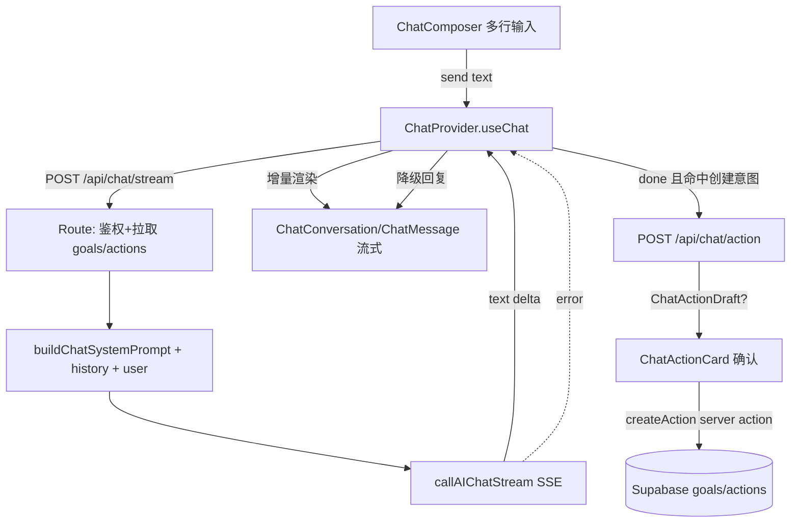

## 用户需求

把 `/chat` 从「单行命令输入 + 命令草案模板」重做成真正对话式的 Premium Life OS 主对话场：后端改为对话式 LLM（支持多轮长文分析/建议/复盘，命令写入降为可选派生能力），前端引入流式 token 呈现，并用多行自动伸缩输入框、克制系统辉光与「系统判断」主视觉、带引导提示的空状态替换现有交互。改动仅限 `/chat` 页面，不影响 today/profile 的全局系统对话入口。

## 产品概览

`/chat` 是认证后默认主页面，定位为「系统对话场」。当前实现了输入与回答同页，但交互仍是命令栏形态，开放性问题被塞进「判断/原因/下一步」模板，缺乏对话感与品牌质感。本方案将其升级为沉浸式、流式、可多轮连续的人生路径推进对话系统，视觉对齐「奢华 AI OS / Premium Life OS」品牌。

## 核心特性

- 多行自动伸缩输入控制台（Enter 发送 / Shift+Enter 换行 / Cmd(Ctrl)+Enter 发送），替代原单行 Input。
- 流式输出：助手回复以 token 逐步呈现，带克制的流式光标与自动滚到底。
- 真正多轮对话后端：LLM 以「人生路径推进系统」口吻做判断/分析/建议/复盘/规划，长文有结构、不强行套模板。
- 可选派生行动：仅当用户明确要创建/推进目标时，流式结束后提取行动草案并渲染可确认卡，确认后复用现有 `createAction` 写入（命令写入降为可选能力）。
- 引导式空状态：冷静的「系统就绪」问候 + 3–4 个人生路径向提示 chip，降低空白页焦虑。
- 永不挂的降级：AI 失败以系统口吻返回可继续的回复，不跳页、不报错式中断。
- 视觉品牌化：克制顶部光晕、边缘微辉光、半透明玻璃层、圆润不臃肿，弱化后台卡片味。

## 技术栈

- 前端：Next.js App Router、React、TypeScript、Tailwind CSS v4、shadcn 风格 UI 组件（项目已有 `components.json` 与 `@/components/ui/*`）。
- 后端：Next.js Route Handler（Node runtime）、Supabase Auth/DB、已有 `src/lib/ai/client.ts` 的 DeepSeek/OpenAI 适配（新增流式变体）。
- 持久化：`localStorage`（仅 /chat 客户端状态，SSR-safe 读取，复用 `system-conversation/store` 的模式）。
- 测试：Node test runner（`node --test`），ESLint + TypeScript typecheck。

## 实现策略

### 总体思路

新增一套只服务于 `/chat` 的对话系统，与既有全局 `SystemChatComposer`/`SystemConversation`/`chat-agent` 完全解耦，避免影响 today/profile。后端用 SSE 流式把 LLM 文本增量推给前端；前端用独立 `ChatProvider` 维护 turns 状态并增量渲染。命令写入不再作为默认模板，仅在检测到「创建/推进」意图时，于流式结束后用一次结构化 LLM 调用提取 `ChatActionDraft`，渲染确认卡，复用 `goals/actions.ts#createAction` 写入。

### 关键技术决策

1. **流式协议用 SSE（text/event-stream）而非 WebSocket**：对话为请求-响应式，SSE 实现简单、天然适配 fetch + ReadableStream，无需常驻连接；沿用 `ai/client.ts` 的超时/中止模式。
2. **新增 `callAIChatStream` 而非改动 `callAIChatJSON`**：DeepSeek 与 OpenAI 均 OpenAI 兼容（`stream:true` 返回 `data:{choices:[{delta:{content}}]}` 行，`[DONE]` 结束）。新增独立函数解析分片，保证既有 JSON 调用零回归。
3. **上下文注入复用既有查询口径**：goals 用 `goals.select(...).eq('status','active')`；今日可执行 actions 复用 `queryWithOwnershipFallback` + `filterExecutableActionsForToday` + `sortActionsForToday`（来自 `lib/chat-agent`），避免重复实现与权限遗漏。
4. **可选行动提取独立端点 `/api/chat/action`**：用 `callAIChatJSON` + 受约束 schema 提取 `ChatActionDraft | null`，仅当用户最新输入命中创建/推进启发式（关键词或 LLM 标记）时调用，控制成本与延迟。
5. **状态持久化 SSR-safe**：`ChatProvider` 初始 `turns=[]`，`useEffect` 内读取 localStorage 合并，写入仅在事件/effect 中，避免 hydration mismatch（与 `system-conversation/store` 一致）。

### 性能与可靠性

- 流式：单条助手消息一个 ReadableStream，增量 `appendAssistantDelta`，O(1) 追加；自动滚到底用 `scrollIntoView` 仅对末尾 ref，避免整列表重排。
- 历史长度：最近 N 轮（默认 6）送上下文，超出截断，防止 token 膨胀；可见 UI 同样最近 N 轮。
- 超时/中止：复用 `AI_TIMEOUT_MS`，客户端断开时 `AbortController` 中断上游 fetch；上游错误映射为 `error` 事件，前端渲染降级回复（不抛异常、不跳页）。
- 行动写入：确认卡调用 server action，失败回退提示，不破坏对话。

## 实现要点

- 复用：Supabase 查询口径、AI provider 配置、`createAction` server action、现有 i18n 字典键结构（新增 chat 相关拷贝）。
- 不修改：`SystemChatComposer`、`SystemConversation`、`SystemTurn`、`SystemMessage`、`lib/system-conversation/*`、`lib/chat-agent/*`、today/profile 入口与 `command/draft` 路由（保留给全局对话）。
- 日志：沿用项目日志约定，不在 SSE 流中打印大载荷；错误仅记录 message，不打用户原文全量。
- 向后兼容：保留 `/chat?source=&prefill=` 语义，空状态按来源给出轻提示。

## 架构设计



## 目录结构

```
src/
├── app/
│   ├── api/
│   │   └── chat/
│   │       ├── stream/route.ts        # [NEW] SSE 流式对话端点：鉴权、注入 goals/actions 上下文、调用 callAIChatStream、按 text/done/error 事件吐流
│   │       └── action/route.ts        # [NEW] 结构化行动提取端点：transcript → ChatActionDraft|null（callAIChatJSON + 受约束 schema）
│   └── (authenticated)/chat/page.tsx  # [MODIFY] 用 ChatProvider 包裹，替换 SystemConversation/SystemChatComposer 为新组件，保留来源语义与空状态 copy
├── lib/
│   ├── ai/stream.ts                   # [NEW] callAIChatStream：解析 DeepSeek/OpenAI SSE 分片，返回 ReadableStream<Uint8Array> 文本增量
│   └── chat/
│       ├── prompt.ts                  # [NEW] buildChatSystemPrompt：把助手框定为「人生路径推进系统」，输出结构化长文+系统判断语气，附 goals/actions 上下文
│       ├── types.ts                   # [NEW] ChatTurn / ChatActionDraft / SSE 事件类型
│       └── store.tsx                  # [NEW] ChatProvider + useChat：turns 状态、appendUser/appendAssistant/appendDelta/finalize/markError、SSR-safe localStorage
├── components/chat/
│   ├── ChatComposer.tsx               # [NEW] 多行自动伸缩 textarea 控制台：Enter/Shift+Enter/Cmd+Enter、主发送按钮、克制辉光玻璃
│   ├── ChatConversation.tsx           # [NEW] 消息流容器：最近 N 轮、自动滚底、空态切换 ChatEmptyState
│   ├── ChatMessage.tsx                # [NEW] 消息渲染：助手「系统判断」主视觉+次级推理+可选行动卡/CTA；用户克制左侧条目；流式光标
│   ├── ChatEmptyState.tsx             # [NEW] 系统就绪问候 + 人生路径向提示 chip（点击预填 composer）
│   └── ChatActionCard.tsx             # [NEW] 可选行动草案确认卡：确认→createAction，成功标记并给跳转入口
├── i18n/zh.json / en.json             # [MODIFY] 新增 chat 相关 UI 文案（空状态、提示 chip、状态标签）
└── tests/
    ├── lib/ai/stream.test.ts          # [NEW] SSE 分片解析单测
    ├── lib/chat/prompt.test.ts        # [NEW] 系统提示组装与上下文注入单测
    └── lib/chat/action-extractor.test.ts # [NEW] 行动提取映射单测
```

## 关键代码结构

```ts
export type ChatRole = 'user' | 'assistant'
export type ChatTurnStatus = 'streaming' | 'done' | 'error'

export type ChatActionDraft = {
  kind: 'goal' | 'action'
  title: string
  goalHint?: string | null
  reason?: string | null
}

export type ChatTurn = {
  id: string
  role: ChatRole
  text: string
  status: ChatTurnStatus
  action?: ChatActionDraft | null
  createdAt: string
}

// SSE 事件契约（route → client）
export type ChatStreamEvent =
  | { type: 'text'; value: string }
  | { type: 'done'; action?: ChatActionDraft | null }
  | { type: 'error'; message: string }
```

## 设计风格

采用「奢华 AI OS / Premium Life OS」方向：深色沉浸底、克制发光、系统核心感。弱化后台卡片味，强化「消息流是页面主轴、输入区是主控制台」。视觉策略：半透明深浅叠层、柔和顶部光晕、边缘轻微辉光、圆润不臃肿轮廓。文案与排版呈现「系统在做判断、高端产品输出结论」的权威感与压迫感，克制、准、不喧哗。

## 页面结构（/chat 单页）

### 1. 轻量顶部状态带

保留一条极轻系统提示（来源页/系统身份），不使用大 Hero 卡片；字号小、字距宽、primary 低饱和。

### 2. 主对话流（视觉中心）

- `ChatConversation` 占满主轴高度，最近 N 轮可见，自动滚到底。
- 用户消息：左侧克制条目，弱强调（小标签「你」+ 文本），不采用花哨聊天气泡。
- 助手消息 `ChatMessage`：以「系统判断」为一级主视觉（较大字号、紧字距、foreground 色、轻微辉光分隔），次级推理为 muted 小字；可选「行动草案」卡以半透明玻璃呈现；可选 next-step CTA 为 refined 圆角按钮；流式时末尾有克制光标。状态标签（系统判断/需要确认/需要澄清/已执行/降级理解）以小徽章呈现，带微光。

### 3. 底部输入控制台

`ChatComposer`：多行自动伸缩 textarea，置于稳定 dock；外层半透明玻璃 + 顶部柔和光晕 + 边缘微辉光 + 圆润（rounded-[1.6rem]）；Enter 发送、Shift+Enter 换行、Cmd/Ctrl+Enter 发送；主发送按钮圆润、hover 微光。整体像「系统核心控制台」而非普通表单。

### 4. 空状态（首次进入）

`ChatEmptyState`：冷静的「系统就绪」问候（一句系统判断式文案）+ 3–4 个优雅提示 chip（如「我现在该推进什么？」「帮我看清今天的主线」「我想开始一条新的人生路径」「最近有点迷茫，帮我理一下」），点击预填输入框；不出现大卡片、不退回 Hero 介绍页。

## 交互与动效

- 流式 token 以克制淡入呈现，末尾光标呼吸式微动。
- hover 微光、按钮 active 轻微缩放（沿用项目既有 `active:scale-[0.985]` 质感）。
- 消息入场轻缓 fade/slide；不堆复杂动效，保持高级克制。
- 桌面/移动一致；移动端输入 dock 不遮挡底部导航。

## Agent Extensions

### Skill

- **frontend-design**
- 用途：在实现 /chat 新 UI 组件（ChatComposer 多行控制台、ChatMessage 系统判断主视觉、ChatEmptyState 引导、ChatActionCard 确认卡）时，产出高设计质量、贴合「奢华 AI OS」品牌的前端代码与样式。
- 预期结果：组件具备克制发光、半透明玻璃、圆润轮廓与编辑式排版，达到 Premium Life OS 的成熟专业观感。
- **playwright-cli**
- 用途：在浏览器中验证 /chat 的流式呈现、多轮连续、空状态引导、降级不挂，并确认 today/profile 全局系统对话入口未被影响。
- 预期结果：关键交互路径通过手动/自动化验证，且全局对话行为无回归。