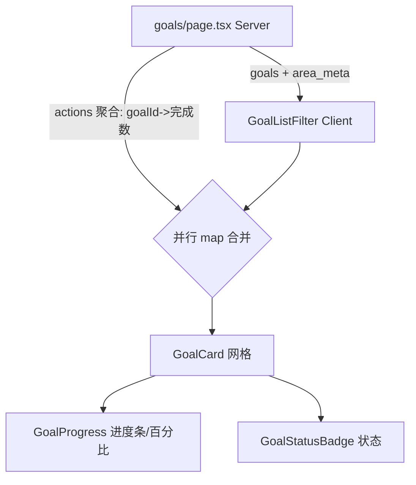

## 用户需求

重新设计 `/goals`（目标列表）页面的 UI，视觉语言与项目保持一致：Emerald 主色 + Zinc 中性、圆角卡片、细边框、暗色模式。

## 产品概述

对现有目标列表页做全维度视觉重构，不涉及顶部概览统计区，保持页面聚焦列表本身。保留现有交互（星标、分类管理、筛选、折叠展开、i18n、无障碍焦点环、暗色模式）。

## 核心特性

- 重构页面布局结构与节奏：头部、吸顶筛选条、分类快速导航、分组区、卡片网格、空状态层次更清晰。
- **管理领域分组做明显 UI 分隔**：每个领域（含归档区）整体包裹为独立面板（`rounded-2xl` + 1px 细边框 + 极淡背景 tint），头部嵌于面板顶部、卡片网格在面板内带内边距，组与组之间不再只是留白平铺，形成清晰视觉层次。
- 强化信息层次：标题/状态/优先级/分类/日期/进度形成明确视觉权重与阅读顺序。
- 提升视觉质感与配色：统一 Emerald/Zinc token、柔和边框与圆角、留白与阴影打磨。
- 卡片增加进度可视化：底部进度条 + 完成百分比，按完成率（关联行动）或时间进度兜底，配语义色。
- 交付一张 AI 生成的重设计视觉预览图。

## 技术栈

- 框架：Next.js App Router（React + TypeScript），现有项目结构
- 样式：Tailwind CSS v4 + 项目既有 shadcn 风格 token（globals.css 中的 --primary 等 CSS 变量）
- 组件：复用项目既有 `components/ui`（Button/Input/Select/Collapsible）、`GoalStatusBadge`、`lucide-react` 图标
- 进度计算：复用 `src/lib/progress.ts`（`calcCompletionPercent` / `calcTimeProgressPercent` / `getUrgencyProgressColor` / `calcDaysLeft`）

## 实现思路

保持「Server Component 取数 → 客户端 `GoalListFilter` 渲染」的数据流不变。进度主来源为目标关联行动的完成率：在 `page.tsx` 用一次分组聚合查询（按 `goal_id` 统计 `count(*)` 与 `count(completed)`，过滤 `archived=false`）得到 `{goalId:{completed,total}}` 映射，下传后在客户端与 goals 并行 map 合并；无关联行动的目标用起止日期的时间进度兜底。新建轻量 `GoalProgress` 组件封装进度条与语义配色，避免 `GoalCard` 膨胀。

## 关键决策与权衡

- 进度聚合放在 Server 端一次 GROUP BY，避免客户端对每个目标发 N 次查询（防 N+1）；映射合并复杂度 O(goals+actions)。
- 进度数据并入既有 `GoalListViewGoal` 类型（新增 `progressPercent`、`progressMode` 等字段），不改动 `buildGoalListViewModel` 的排序/过滤逻辑，降低回归面。
- 严格沿用现有 token 与 shadcn 约定（cva 变体、`rounded-2xl`、`backdrop-blur`、暗色 `.dark`），不与项目割裂；不引入新设计体系。

## 实现要点（防回归）

- 复用 `GoalStatusBadge` 渲染右上角状态，不重写徽章样式。
- 保留 `toggleGoalStar`、`AreaManageDialog`、筛选、折叠展开、i18n（`dict.goals.*`）等全部交互。
- 进度条用 `getUrgencyProgressColor` 取色（逾期 destructive / ≤7 天 orange / 否则 primary）；`group-hover` 仅做边框过渡，避免额外重渲染。
- 改动仅限 goals 相关文件，不触碰 today/dashboard 等其他页面。

## 架构设计



数据流与现状一致，仅增加进度聚合分支；`GoalProgress` 为纯展示组件，输入 `percent` 与 `mode`。

## 目录结构

```
src/
├── app/(authenticated)/goals/
│   └── page.tsx            # [MODIFY] Server Component。新增 actions 按 goal_id 聚合查询(count/completed, archived=false)，构建 progressMap 下传给 GoalListFilter；其余取数不变。
├── components/
│   ├── GoalListFilter.tsx  # [MODIFY] 重构吸顶筛选条(第一排)、领域 tab 保持原始两排独立圆角 pill 样式(经用户确认优于 segmented 容器方案)；每个管理领域(含归档)包裹为独立面板(rounded-2xl+细边框+淡背景 tint)，头部嵌面板顶部、卡片网格带内边距；GoalCard 接入进度与优化信息层次；空状态保留。
│   └── GoalProgress.tsx    # [NEW] 进度条小组件。Props: percent, mode('action'|'time'), optionalLabel；封装 calcCompletionPercent/getUrgencyProgressColor，渲染圆角细进度条与百分比文字，亮/暗色适配。
└── lib/
    └── goal-list-view.ts   # [MODIFY] GoalListViewGoal 增加 progressPercent?: number、progressMode?: 'action'|'time'；buildGoalListViewModel 签名增加可选 progressMap 并在映射时合并，不改变既有排序/过滤。
```

## 设计风格

保持与项目一致的现代极简 + Emerald 点缀风格：亮色以纯白/锌灰为底，卡片用柔和边框与 `rounded-2xl`、轻投影与悬停边框过渡；暗色沿用 Zinc-900 卡片与半透明高亮。全局圆角统一 0.5rem，状态用语义色（active 翡翠绿、completed 蓝、abandoned 板岩、archived 锌），配色严格复用项目 token，不引入新色板。

## 页面区块设计（自上而下）

- 顶部标题区：左侧大标题 + 次级副标题（muted），右侧「新建目标」翡翠绿圆角实心按钮带悬停减淡与焦点环；与下方内容用留白分隔，强化首屏层次。
- 吸顶筛选工具条（第一排，常驻）：半透明背景 + `backdrop-blur`，左侧搜索圆角 pill（前缀搜索图标），右侧状态 Select 圆角 pill；下方用一条细分隔线与内容区分，滚动时常驻。
- 分类快速导航（第二排，保持原样）：保留两排布局，领域 tab 维持原始独立圆角 pill 样式（图标 + 名称 + `· 数量`，hover 填充背景；「分类管理」翡翠绿淡底收尾）。经用户确认该样式优于重做的 segmented 容器方案，故回退，仅保留面板分隔与进度增强等其余重构。
- 分组面板（含头部）：每个领域整体为一个独立面板。头部左侧折叠箭头 + 分类图标 + 标题与数量，右侧一行小字展示「进行中/已完成」并附该组微型完成度条；面板用 `rounded-2xl` + 1px 细边框 + 极淡背景 tint 包裹，卡片网格在面板内带内边距，组间用留白分隔形成清晰层次。归档区复用同一面板样式，仅以降低不透明度弱化。
- 目标卡片网格：响应式 1/2/3 列；卡片顶部标题 + 星标 + 状态徽章，中部描述（截断），底部一行 meta（分类标签/优先级圆点/起止日期），最底一条细进度条 + 完成百分比（语义配色），悬停边框提亮、整体柔和。
- 空状态：虚线圆角卡片、居中图标、标题与引导文案，未筛选时显示新建入口。
- 归档折叠区：与分组一致的折叠头部，内容以降低不透明度呈现，弱化但不丢失。

## Agent Extensions

### Skill

- **hallmark**
- Purpose: 对重设计方案做 anti-AI-slop 设计审查与打磨，确保目标列表页视觉精致、层次清晰、非模板化，符合现代极简 + Emerald 风格。
- Expected outcome: 产出设计质量评审与具体优化点，消除平庸/通用感，确认与项目 token 一致。
- **多模态内容生成**
- Purpose: 依据重设计规划与区块描述，生成一张 `/goals` 页面重设计后的视觉预览图（文生图片）。
- Expected outcome: 得到可直观确认风格的目标列表页预览图，作为规划交付物之一。

### SubAgent

- **ui-visual-validator**
- Purpose: 在实现完成后对重设计页面做截图与视觉/无障碍校验，确认布局、信息层次、配色、进度条与暗色模式达标。
- Expected outcome: 输出校验结论与回归清单，确认 UI 达到预期且无破坏。