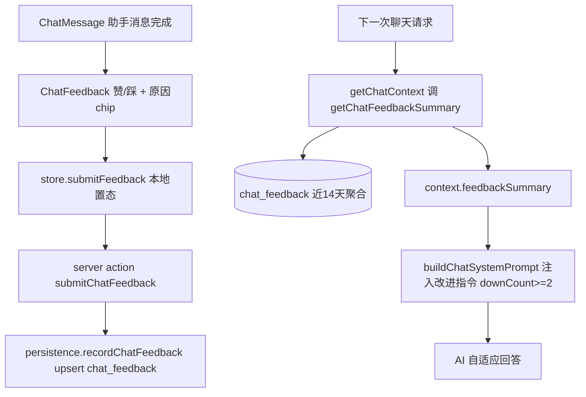

## 用户需求

在 `localhost:3000/chat` 的每条助手回答下方，新增「喜欢 / 不喜欢」反馈功能，让用户对系统答案进行评价。

## 产品概述

用户可对每条聊天回答点「赞」或「踩」。点「踩」时弹出若干预设原因供选择。所有反馈由系统落库记录，并用于**真正闭环**地优化后续回答——服务端在下一次生成回答时读取近期负反馈，把改进指令注入 system prompt，使 AI 自适应调整语气与内容。

## 核心功能

- **赞 / 踩 交互**：助手回答渲染完成后，在消息底部出现点赞、点踩两个按钮；点击即时高亮、可切换。
- **预设原因**：点「踩」后展开原因 chip（太啰嗦 / 不相关 / 不准确 / 想更具体），选择后提交；点赞无需原因。
- **提交后反馈**：提交后显示「感谢反馈」轻提示，按钮区收起为已选态，可再次切换。
- **数据记录**：每次反馈写入独立 `chat_feedback` 表（user_id / turn_id / rating / reason / excerpt / created_at），按 `(user_id, turn_id)` 唯一约束支持 upsert，避免重复落行。
- **闭环优化**：服务端读取用户近 14 天反馈，聚合负反馈次数与高频原因；当近 14 天负反馈 ≥ 2 条时，把对应的改进指令注入后续回答的 system prompt（如「更简洁 / 更贴合真实行动 / 更严谨 / 更具体可执行」），让 AI 自适应。
- **降级保护**：反馈读取或写入失败均不影响聊天主流程（try/catch 降级）；无显著负反馈信号时不注入任何指令，避免噪声。

## 技术栈

- 前端：Next.js（App Router）+ React + TypeScript + Tailwind CSS（复用系统主题 token，shadcn 体系）
- 后端：Next.js Server Actions + Supabase（RLS 鉴权）
- 数据：新增 `chat_feedback` 表（PostgreSQL），复用现有迁移编号范式（40/41）
- 样式：复用系统主题 CSS 变量（emerald 主色 / zinc 中性 / card / border / muted）

## 实现方案

### 关键决策

1. **独立表 + upsert**：新建 `chat_feedback`，以 `(user_id, turn_id)` 建唯一索引，写库用 `supabase.from('chat_feedback').upsert(..., { onConflict: 'user_id,turn_id' })`。用户切换赞/踩不会产生重复行，且能覆盖旧反馈（含原因清空）。
2. **闭环分两层**：

- 读：`getChatFeedbackSummary(supabase, userId)` 查近 14 天、上限 200 行，聚合 `downCount / upCount / topReasons`（按 reason 计数的降序前几）。
- 注入：`buildChatSystemPrompt` 接收 `context.feedbackSummary`，仅在 `downCount >= 2` 时追加「用户反馈改进指令」段落，原因→指令映射集中在 `feedback.ts` 的 `buildFeedbackDirective`，保持 `prompt.ts` 纯净。

3. **复用现有链路，最小爆破面**：stream 路由已调用 `getChatContext` 并把 `context` 交给 `buildChatSystemPrompt`，因此闭环只需在 `getChatContext` 内（带 try/catch 降级）补充 feedbackSummary，路由无需改动。
4. **客户端即时态 + 异步落库**：store 的 `submitFeedback` 先本地更新 `turn.feedback`（即时高亮 / 收起），再调 server action 写库；写库失败不影响 UI。
5. **excerpt 截断**：落库时存助手回答前 280 字（`turn.text.slice(0,280)`），供后续分析，避免大字段。

### 性能与复用

- 每次聊天请求仅多一次窄查询（带 `user_id + created_at` 索引、14 天窗口、200 行上限），开销可忽略；失败降级不影响主流程。
- 完全复用 `persistence.ts` 写库范式（已认证 supabase + userId，可单测）与 `actions.ts` server action 范式（鉴权 + 委托 + 错误结构）。
- `ChatTurn` 向后兼容新增可选 `feedback` 字段；`ChatCopy` 新增文案键（zh/en 同步，否则类型推断失败）。

## 实现注意事项

- SQL 复用已有 `update_updated_at_column()` 触发器（迁移 18 已定义）；RLS 启用后建 select/insert/update own 三条策略（upsert 需要 update 权限）。
- `reason` 用 `check` 约束限定为四个枚举；`rating` 限定 `'up'/'down'`。
- 反馈 UI 严格用主题 token（如 `text-muted-foreground` / `border-border` / `hover:bg-primary/10`），不使用硬编码色值，保持与聊天页视觉同源。
- excerpt 截断在服务端写库前由客户端传入，避免服务端再查消息（消息本就不落库）。

## 架构设计



## 目录结构

```
supabase/
├── 40_chat_feedback.sql        # [NEW] 建 chat_feedback 表：id/user_id/turn_id/rating/reason/excerpt/created_at/updated_at；唯一索引 (user_id,turn_id)；created_at 索引；updated_at 触发器
└── 41_chat_feedback_rls.sql    # [NEW] 启用 RLS，建 select/insert/update own 三条策略（on delete cascade + user_id 校验）

src/lib/chat/
├── types.ts                    # [MODIFY] 新增 ChatFeedbackReason 联合类型、ChatTurnFeedback 类型；ChatTurn 增 feedback? 字段；ChatCopy 增反馈相关文案键
├── persistence.ts              # [MODIFY] 新增 recordChatFeedback(supabase,userId,input) upsert 写库，返回结构化 error，可单测
├── feedback.ts                 # [NEW] getChatFeedbackSummary（近14天聚合 downCount/upCount/topReasons）；buildFeedbackDirective(summary,locale) 生成改进指令文本
├── context.ts                  # [MODIFY] ChatContext 增 feedbackSummary? 字段；getChatContext 内 try/catch 调 getChatFeedbackSummary 并填入
└── prompt.ts                   # [MODIFY] buildChatSystemPrompt 接收 feedbackSummary，downCount>=2 时注入 buildFeedbackDirective 结果

src/app/(authenticated)/chat/
└── actions.ts                  # [MODIFY] 新增 submitChatFeedback(formData) server action：鉴权 + 调 recordChatFeedback + 错误结构

src/components/chat/
├── ChatFeedback.tsx            # [NEW] 赞/踩按钮 + 踩时原因 chip + 感谢态；主题 token 化，props: turnId/feedback/copy/onSubmit(rating,reason?)
├── ChatMessage.tsx             # [MODIFY] 助手且 status==='done' 时渲染 ChatFeedback，新增 onSubmitFeedback 透传
├── ChatConversation.tsx        # [MODIFY] 透传 onSubmitFeedback 到 ChatMessage
└── ChatSurface.tsx             # [MODIFY] 从 useChat 取 submitFeedback 并传给 ChatConversation

src/lib/chat/store.tsx          # [MODIFY] ChatContextValue 增 submitFeedback；实现本地置态 + 调 submitChatFeedback（含 excerpt 截断）

src/i18n/
├── zh.json                     # [MODIFY] chat 块新增 feedbackPrompt/like/dislike/feedbackReasonPrompt/reasonTooVerbose/reasonNotRelevant/reasonInaccurate/reasonWantSpecific/feedbackThanks
└── en.json                     # [MODIFY] 同步上述英文键

tests/lib/chat/
└── feedback.test.ts            # [NEW] recordChatFeedback upsert 幂等性 + getChatFeedbackSummary 聚合逻辑单测（mock supabase）
```

## 关键代码结构

```ts
// src/lib/chat/types.ts
export type ChatFeedbackReason = 'too_verbose' | 'not_relevant' | 'inaccurate' | 'want_specific'
export type ChatTurnFeedback = { rating: 'up' | 'down'; reason?: ChatFeedbackReason | null }
// ChatTurn 新增：feedback?: ChatTurnFeedback | null

// src/lib/chat/feedback.ts
export type ChatFeedbackSummary = {
  downCount: number
  upCount: number
  topReasons: Array<{ reason: ChatFeedbackReason; count: number }>
}
export async function getChatFeedbackSummary(
  supabase: SupabaseClient, userId: string, opts?: { days?: number; limit?: number }
): Promise<ChatFeedbackSummary>
export function buildFeedbackDirective(summary: ChatFeedbackSummary | null, locale: 'zh' | 'en'): string
```

## 设计风格

反馈条沿用聊天页既有「System OS / 极简 / Emerald 主色 / 亮色优先」语言，作为助手消息底部一行轻量、克制的操作区，不喧宾夺主。

## 页面区块（仅助手消息底部反馈条）

- **反馈触发行**：消息正文与引用/行动卡片之下，一条细分隔（`border-border`），左侧小字提示「这条回答有帮助吗？」（`text-muted-foreground`，12–13px），右侧两个幽灵按钮：点赞（ThumbsUp）、点踩（ThumbsDown），默认 `text-muted-foreground`，hover 显 `bg-primary/10` 微光，选中态点赞转 `text-primary`、点踩转 `text-red-500/90`，带 150ms 过渡。
- **原因选择层**：点踩后在同一行下方展开 4 个圆角 chip（太啰嗦 / 不相关 / 不准确 / 想更具体），`border-border bg-card`，hover `border-primary/40 text-foreground`，点击即提交并收起。
- **感谢态**：提交后按钮区替换为「感谢反馈」小标签（`text-muted-foreground`），保留已选图标高亮，允许再次点击切换（即时覆盖）。
- **响应式**：桌面端与消息气泡同宽靠左；移动端单列贴底，按钮与 chip 可换行不溢出。所有色彩仅用主题 token，亮/暗自适应。