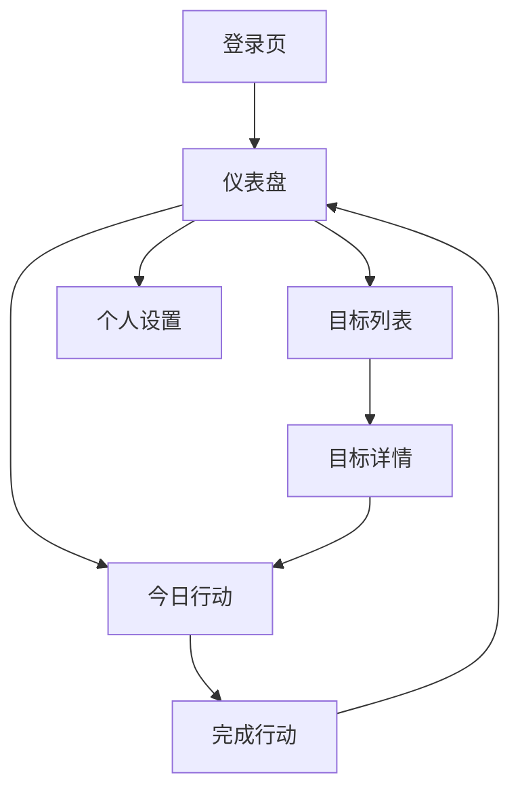

## 1. 产品概述

个人目标系统是一个专注于帮助用户管理长期目标和日常行动的工具。通过简洁的界面和科学的目标管理方法，让用户每天愿意打开一次，持续追踪进度，建立正向习惯。
**系统支持中英文双语切换，满足全球化用户需求。**

产品核心价值：将复杂的目标管理方法论转化为简单易用的数字工具，帮助用户建立可持续的个人成长系统。

## 2. 核心功能

### 2.1 用户角色

| 角色   | 注册方式 | 核心权限                    |
| ---- | ---- | ----------------------- |
| 普通用户 | 邮箱注册 | 创建目标、记录行动、查看进度、**切换语言** |

### 2.2 功能模块

MVP版本包含以下核心页面：

1. **登录页**：用户身份验证
2. **仪表盘**：今日总览，展示核心行动和进度
3. **目标列表**：阶段目标管理，**支持优先级和分类管理**
4. **目标详情**：具体目标内容和相关行动
5. **今日行动**：核心行动记录
6. **个人设置**：**语言偏好设置**、账户管理

### 2.3 页面详情

| 页面名称 | 模块名称   | 功能描述                                     |
| ---- | ------ | ---------------------------------------- |
| 登录页  | 身份验证   | 支持邮箱注册和登录                                |
| 仪表盘  | 今日核心行动 | 显示今日最重要的1个行动                             |
| 仪表盘  | 今日评分   | 0-5分快速评分入口                               |
| 仪表盘  | 目标进度   | 当前活跃目标的完成进度                              |
| 仪表盘  | 连续天数   | 显示连续完成行动的天数                              |
| 目标列表 | 阶段目标   | 展示所有3-6个月的目标                             |
| 目标列表 | 新建目标   | 创建新的阶段目标，**支持设置优先级(High/Medium/Low)和分类** |
| 目标列表 | 目标卡片   | 展示目标进度、剩余天数、优先级标记                        |
| 目标详情 | 目标信息   | 显示目标定义、完成标准、放弃标准、**优先级、分类**              |
| 目标详情 | 相关行动   | 展示该目标下的所有行动，**支持添加跨天行动**                 |
| 今日行动 | 行动记录   | 记录今日核心行动和可选行动                            |
| 今日行动 | 完成状态   | 标记行动完成或未完成                               |
| 个人设置 | 通用设置   | **切换系统语言 (English/中文)**                  |

## 3. 核心流程

### 用户主要操作流程：

1. 用户注册登录 → 进入仪表盘
2. 在仪表盘查看今日核心行动 → 完成行动后标记完成
3. 进行今日评分 → 查看进度更新
4. 创建阶段目标 → 设定完成标准、放弃标准、**优先级和分类**
5. 每日记录行动 → 追踪目标进度

## 4. 用户界面设计

### 4.1 设计风格

* **设计系统**：基于 Shadcn UI (Radix UI + Tailwind CSS) 构建，风格现代简洁。

* **色彩系统**：

  * **Primary**: 品牌主色 (Default: Zinc/Slate based)，用于主要按钮和强调元素。

  * **Background**: 自适应背景色，支持明暗模式。

  * **Muted**: 柔和的辅助色，用于次要信息。

* **交互反馈**：

  * 按钮悬停、点击均有微交互动画。

  * 数据加载使用 Skeleton 骨架屏。

  * 操作成功/失败使用 Toast 提示。

* **图标系统**：统一使用 Lucide React 线性图标。

### 4.2 页面设计概述

| 页面名称 | 模块名称   | UI元素                                                    |
| ---- | ------ | ------------------------------------------------------- |
| 全局导航 | 侧边栏    | **可折叠侧边栏 (Desktop) / 底部导航 (Mobile)**，包含品牌Logo、导航菜单、退出按钮 |
| 仪表盘  | 今日核心行动 | 大卡片突出显示，绿色完成按钮，简洁的行动描述                                  |
| 仪表盘  | 进度展示   | 进度条使用平滑动画，显示百分比数字                                       |
| 目标列表 | 目标卡片   | 卡片式设计，右上角显示优先级Badge，底部显示进度条                             |
| 目标详情 | 信息展示   | 分组显示定义、完成标准等，**使用 Tab 或卡片分组**                           |
| 今日行动 | 行动列表   | 复选框样式，支持快速标记完成，过期行动样式区分                                 |

### 4.3 响应式设计

* **桌面端**: 左侧固定侧边栏，右侧内容区域自适应。

* **移动端**: 侧边栏自动隐藏或转换为底部导航/抽屉菜单，内容区域全屏展示。

* **触控优化**: 增大移动端点击热区，确保操作舒适度。

## 5. 数据可视化

* **进度条**: 直观显示目标完成百分比 (基于 Shadcn Progress 组件)。

* **连续天数**: 仪表盘展示连续打卡天数。

* **趋势图**: 使用 Recharts 绘制最近评分趋势，支持交互查看具体数值。

* **完成率**: 统计面板显示周期内的行动完成情况。
