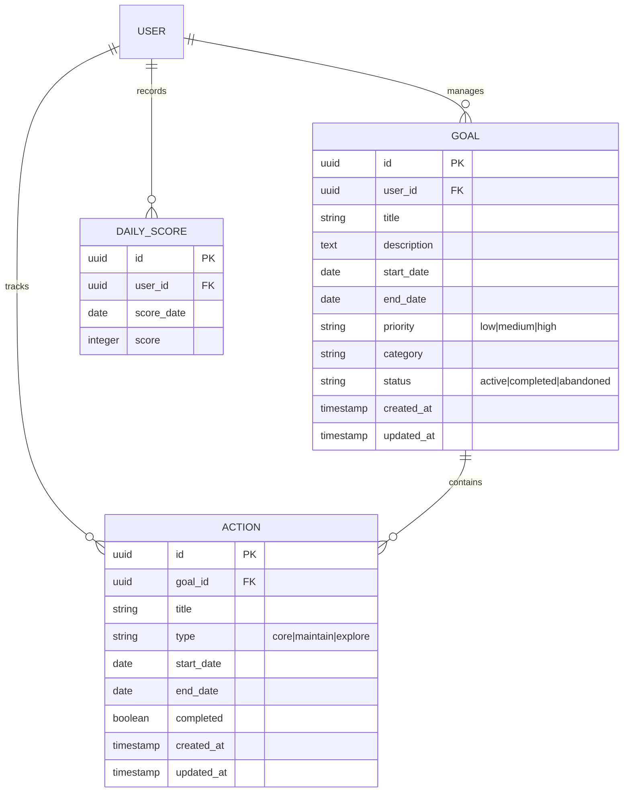

## 1. 架构设计

```mermaid
graph TD
    A[User Browser] --> B[Next.js App Router]
    B --> C[Server Components]
    B --> D[Server Actions]
    C --> E[Supabase SDK (SSR)]
    D --> E
    E --> F[Supabase Auth]
    E --> G[Supabase Database]
    E --> H[Supabase Storage]

    subgraph "Frontend & BFF Layer (Next.js)"
        B
        C
        D
    end

    subgraph "Service Layer (Supabase)"
        F
        G
        H
    end
```

## 2. 技术栈描述

- **前端框架**: Next.js 16.1 (App Router)
- **核心库**: React 19.2
- **样式方案**: Tailwind CSS 4.0 + Radix UI (Headless UI) + Lucide React (Icons)
- **状态管理**: Zustand 5.0 (配合 Server State)
- **后端服务**: Supabase (BaaS)
- **数据交互**: Server Actions + Server Components
- **国际化**: Custom i18n implementation (English/Chinese)
- **部署**: Vercel

## 3. 路由结构 (App Router)

| 路由 | 文件路径 | 用途 |
|------|----------|------|
| / | src/app/page.tsx | 落地页 |
| /login | src/app/login/page.tsx | 登录/注册 |
| /dashboard | src/app/(authenticated)/dashboard/page.tsx | 仪表盘 |
| /goals | src/app/(authenticated)/goals/page.tsx | 目标列表 |
| /goals/new | src/app/(authenticated)/goals/new/page.tsx | 创建目标 |
| /goals/[id] | src/app/(authenticated)/goals/[id]/page.tsx | 目标详情 |
| /today | src/app/(authenticated)/today/page.tsx | 今日行动 |
| /profile | src/app/(authenticated)/profile/page.tsx | 个人设置 |

## 4. 数据模型

### 4.1 核心实体关系



### 4.2 数据库 Schema 更新说明

**Goals Table**
- 新增字段 `priority`: 目标优先级 (default: 'medium')
- 新增字段 `category`: 目标分类 (default: 'other')

**Actions Table**
- 字段迁移: `action_date` 逐步迁移至 `start_date`
- 新增字段 `end_date`: 支持跨天行动

## 5. 核心交互机制 (Server Actions)

系统采用 Next.js Server Actions 处理数据变更，确保类型安全和前后端逻辑紧密结合。

### 5.1 目标管理 (`src/app/(authenticated)/goals/actions.ts`)
- `createGoal(formData)`: 创建新目标，支持优先级和分类设置
- `updateGoal(formData)`: 更新目标详情
- `deleteGoal(formData)`: 删除目标及其关联的所有行动

### 5.2 行动管理 (`src/app/(authenticated)/goals/actions.ts`)
- `createAction(formData)`: 创建行动，支持日期范围
- `updateAction(formData)`: 更新行动信息
- `deleteAction(formData)`: 删除指定行动

### 5.3 仪表盘交互 (`src/app/(authenticated)/dashboard/actions.ts`)
- `toggleAction(formData)`: 切换行动的完成状态 (Optimistic Update support in UI)
- `submitScore(formData)`: 提交每日评分 (Upsert logic)

## 6. 部署配置

### 6.1 环境变量
```bash
NEXT_PUBLIC_SUPABASE_URL=...
NEXT_PUBLIC_SUPABASE_ANON_KEY=...
```

### 6.2 项目配置
- `next.config.ts`: Next.js 配置文件
- `tailwind.config.ts`: (v4 集成在 CSS 中或单独配置)
- `middleware.ts`: 处理路由保护和重定向
