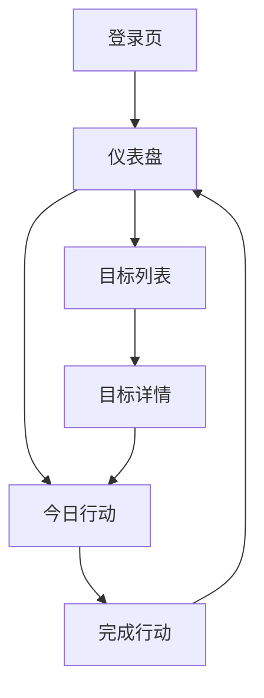

## 1. 产品概述
个人目标系统是一个专注于帮助用户管理长期目标和日常行动的工具。通过简洁的界面和科学的目标管理方法，让用户每天愿意打开一次，持续追踪进度，建立正向习惯。

产品核心价值：将复杂的目标管理方法论转化为简单易用的数字工具，帮助用户建立可持续的个人成长系统。

## 2. 核心功能

### 2.1 用户角色
| 角色 | 注册方式 | 核心权限 |
|------|----------|----------|
| 普通用户 | 邮箱注册 | 创建目标、记录行动、查看进度 |

### 2.2 功能模块
MVP版本包含以下核心页面：
1. **登录页**：用户身份验证
2. **仪表盘**：今日总览，展示核心行动和进度
3. **目标列表**：阶段目标管理
4. **目标详情**：具体目标内容和相关行动
5. **今日行动**：核心行动记录

### 2.3 页面详情
| 页面名称 | 模块名称 | 功能描述 |
|----------|----------|----------|
| 登录页 | 身份验证 | 支持邮箱注册和登录 |
| 仪表盘 | 今日核心行动 | 显示今日最重要的1个行动 |
| 仪表盘 | 今日评分 | 0-5分快速评分入口 |
| 仪表盘 | 目标进度 | 当前活跃目标的完成进度 |
| 仪表盘 | 连续天数 | 显示连续完成行动的天数 |
| 目标列表 | 阶段目标 | 展示所有3-6个月的目标 |
| 目标列表 | 新建目标 | 创建新的阶段目标 |
| 目标详情 | 目标信息 | 显示目标定义、完成标准、放弃标准 |
| 目标详情 | 相关行动 | 展示该目标下的所有行动 |
| 今日行动 | 行动记录 | 记录今日核心行动和可选行动 |
| 今日行动 | 完成状态 | 标记行动完成或未完成 |

## 3. 核心流程

### 用户主要操作流程：
1. 用户注册登录 → 进入仪表盘
2. 在仪表盘查看今日核心行动 → 完成行动后标记完成
3. 进行今日评分 → 查看进度更新
4. 创建阶段目标 → 设定完成标准和放弃标准
5. 每日记录行动 → 追踪目标进度

## 4. 用户界面设计

### 4.1 设计风格
- **主色调**：深绿色（#10B981）代表成长和进步
- **辅助色**：浅灰色（#F3F4F6）作为背景，深灰色（#374151）用于文字
- **按钮样式**：圆角设计，主要操作用实心按钮，次要操作用边框按钮
- **字体**：系统默认字体，标题16-18px，正文14px
- **布局风格**：卡片式布局，清晰的信息层级
- **图标风格**：简洁的线性图标，避免过度装饰

### 4.2 页面设计概述
| 页面名称 | 模块名称 | UI元素 |
|----------|----------|----------|
| 仪表盘 | 今日核心行动 | 大卡片突出显示，绿色完成按钮，简洁的行动描述 |
| 仪表盘 | 进度展示 | 进度条使用绿色渐变，显示百分比数字 |
| 目标列表 | 目标卡片 | 白色卡片，显示目标标题、进度条、剩余天数 |
| 目标详情 | 信息展示 | 分组显示定义、完成标准、放弃标准，使用清晰的标题 |
| 今日行动 | 行动列表 | 复选框样式，支持快速标记完成 |

### 4.3 响应式设计
- 采用桌面优先设计，默认适配桌面端
- 移动端自适应，保持核心功能可用性
- 触摸交互优化，按钮大小适合手指点击

## 5. 数据可视化
- **进度条**：直观显示目标完成百分比
- **连续天数**：用数字和火焰图标表示
- **趋势图**：最近7天和30天的评分趋势，使用简单折线图
- **完成率**：显示本周/本月的行动完成率，允许失败但不羞辱用户