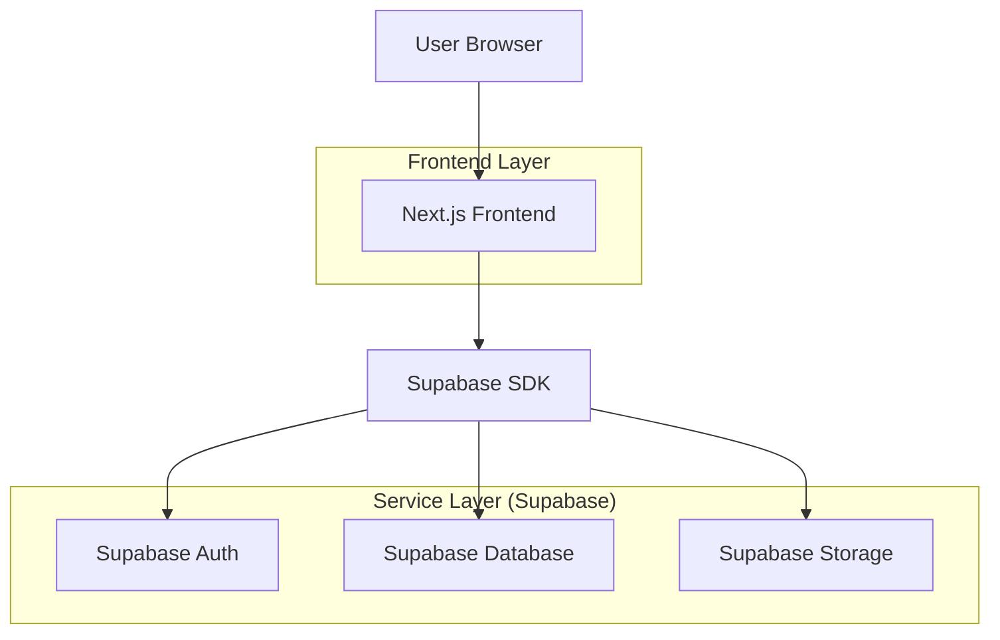
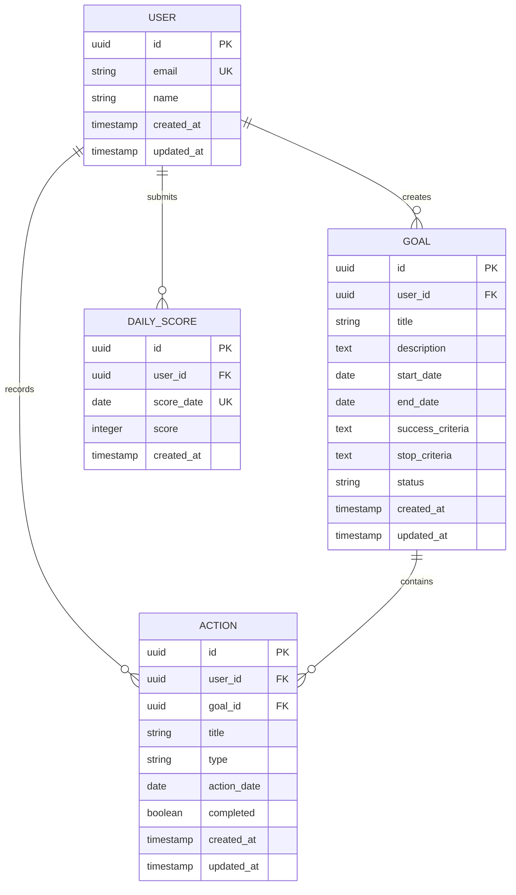

## 1. 架构设计



## 2. 技术栈描述

- **前端**: Next.js 14 (App Router) + React 18 + Tailwind CSS
- **初始化工具**: create-next-app
- **状态管理**: Zustand (轻量级状态管理)
- **后端服务**: Supabase (全托管BaaS平台)
- **认证**: Supabase Auth (内置邮箱认证)
- **数据库**: Supabase PostgreSQL
- **部署**: Vercel (与Next.js完美集成)

## 3. 路由定义

| 路由 | 用途 |
|------|------|
| /login | 登录注册页面 |
| /dashboard | 仪表盘，今日总览 |
| /goals | 目标列表页面 |
| /goals/[id] | 目标详情页面 |
| /today | 今日行动页面 |
| /profile | 用户设置页面 |

## 4. 数据模型

### 4.1 数据模型定义



### 4.2 数据定义语言

用户表 (users)
```sql
-- 创建用户表（Supabase Auth自动创建，无需手动创建）
-- 只需要创建用户资料扩展表
CREATE TABLE user_profiles (
    id UUID PRIMARY KEY REFERENCES auth.users(id) ON DELETE CASCADE,
    name VARCHAR(100) NOT NULL,
    created_at TIMESTAMP WITH TIME ZONE DEFAULT NOW(),
    updated_at TIMESTAMP WITH TIME ZONE DEFAULT NOW()
);

-- 创建索引
CREATE INDEX idx_user_profiles_id ON user_profiles(id);
```

目标表 (goals)
```sql
-- 创建目标表
CREATE TABLE goals (
    id UUID PRIMARY KEY DEFAULT gen_random_uuid(),
    user_id UUID NOT NULL REFERENCES auth.users(id) ON DELETE CASCADE,
    title VARCHAR(200) NOT NULL,
    description TEXT,
    start_date DATE NOT NULL,
    end_date DATE NOT NULL,
    success_criteria TEXT NOT NULL,
    stop_criteria TEXT NOT NULL,
    status VARCHAR(20) DEFAULT 'active' CHECK (status IN ('active', 'completed', 'abandoned')),
    created_at TIMESTAMP WITH TIME ZONE DEFAULT NOW(),
    updated_at TIMESTAMP WITH TIME ZONE DEFAULT NOW()
);

-- 创建索引
CREATE INDEX idx_goals_user_id ON goals(user_id);
CREATE INDEX idx_goals_status ON goals(status);
```

行动表 (actions)
```sql
-- 创建行动表
CREATE TABLE actions (
    id UUID PRIMARY KEY DEFAULT gen_random_uuid(),
    user_id UUID NOT NULL REFERENCES auth.users(id) ON DELETE CASCADE,
    goal_id UUID NOT NULL REFERENCES goals(id) ON DELETE CASCADE,
    title VARCHAR(200) NOT NULL,
    type VARCHAR(20) DEFAULT 'core' CHECK (type IN ('core', 'maintain', 'explore')),
    action_date DATE NOT NULL,
    completed BOOLEAN DEFAULT FALSE,
    created_at TIMESTAMP WITH TIME ZONE DEFAULT NOW(),
    updated_at TIMESTAMP WITH TIME ZONE DEFAULT NOW()
);

-- 创建索引
CREATE INDEX idx_actions_user_id ON actions(user_id);
CREATE INDEX idx_actions_goal_id ON actions(goal_id);
CREATE INDEX idx_actions_date ON actions(action_date);
```

每日评分表 (daily_scores)
```sql
-- 创建每日评分表
CREATE TABLE daily_scores (
    id UUID PRIMARY KEY DEFAULT gen_random_uuid(),
    user_id UUID NOT NULL REFERENCES auth.users(id) ON DELETE CASCADE,
    score_date DATE NOT NULL,
    score INTEGER NOT NULL CHECK (score >= 0 AND score <= 5),
    created_at TIMESTAMP WITH TIME ZONE DEFAULT NOW(),
    UNIQUE(user_id, score_date)
);

-- 创建索引
CREATE INDEX idx_daily_scores_user_id ON daily_scores(user_id);
CREATE INDEX idx_daily_scores_date ON daily_scores(score_date);
```

### 4.3 Row Level Security (RLS) 策略

```sql
-- 启用RLS
ALTER TABLE user_profiles ENABLE ROW LEVEL SECURITY;
ALTER TABLE goals ENABLE ROW LEVEL SECURITY;
ALTER TABLE actions ENABLE ROW LEVEL SECURITY;
ALTER TABLE daily_scores ENABLE ROW LEVEL SECURITY;

-- 基本权限设置
GRANT SELECT ON user_profiles TO anon;
GRANT ALL ON user_profiles TO authenticated;
GRANT SELECT ON goals TO anon;
GRANT ALL ON goals TO authenticated;
GRANT SELECT ON actions TO anon;
GRANT ALL ON actions TO authenticated;
GRANT SELECT ON daily_scores TO anon;
GRANT ALL ON daily_scores TO authenticated;

-- RLS策略示例（用户只能访问自己的数据）
CREATE POLICY "用户只能查看自己的资料" ON user_profiles
    FOR ALL USING (auth.uid() = id);

CREATE POLICY "用户只能查看自己的目标" ON goals
    FOR ALL USING (auth.uid() = user_id);

CREATE POLICY "用户只能查看自己的行动" ON actions
    FOR ALL USING (auth.uid() = user_id);

CREATE POLICY "用户只能查看自己的评分" ON daily_scores
    FOR ALL USING (auth.uid() = user_id);
```

## 5. 核心API接口

### 5.1 目标管理API

```typescript
// 创建目标
POST /api/goals

// 获取用户目标列表
GET /api/goals

// 获取单个目标详情
GET /api/goals/:id

// 更新目标
PUT /api/goals/:id

// 删除目标
DELETE /api/goals/:id
```

### 5.2 行动管理API

```typescript
// 创建行动
POST /api/actions

// 获取今日行动
GET /api/actions/today

// 更新行动状态
PUT /api/actions/:id/complete

// 获取目标相关行动
GET /api/goals/:id/actions
```

### 5.3 评分API

```typescript
// 提交每日评分
POST /api/daily-scores

// 获取评分历史
GET /api/daily-scores/history

// 获取统计数据
GET /api/daily-scores/stats
```

## 6. 部署配置

### 6.1 环境变量
```bash
# Supabase配置
NEXT_PUBLIC_SUPABASE_URL=your_supabase_url
NEXT_PUBLIC_SUPABASE_ANON_KEY=your_supabase_anon_key
SUPABASE_SERVICE_ROLE_KEY=your_service_role_key

# 应用配置
NEXT_PUBLIC_APP_URL=https://your-domain.com
```

### 6.2 Vercel部署配置
```json
{
  "buildCommand": "npm run build",
  "outputDirectory": ".next",
  "installCommand": "npm install",
  "framework": "nextjs"
}
```