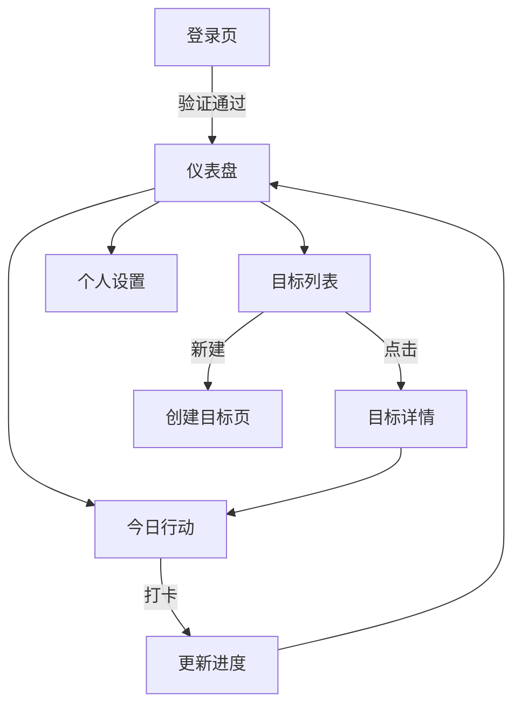

# MVP 产品需求文档 (已发布 / Released)

**状态**：✅ 已完成开发并发布 (Phase 1 Completed)
**版本**：v1.0.0
**后续规划**：请参考 [产品 - 01 产品路线图.md](产品%20-%2001%20产品路线图.md) 中的 Phase 2。

---

## 1. 产品概述
个人目标系统是一个专注于帮助用户管理长期目标和日常行动的工具。
**目前版本已支持中英文双语切换，满足基础的目标管理闭环。**

## 2. 核心功能状态一览

### 2.1 用户角色
| 角色 | 状态 | 核心权限 |
| :--- | :--- | :--- |
| 普通用户 | ✅ | 创建目标、记录行动、查看进度、切换语言 |

### 2.2 功能模块实现情况

#### 1. 认证模块 (Authentication)
*   ✅ **登录/注册**：支持邮箱密码注册与登录 (Supabase Auth)。
*   ✅ **密码重置**：完整的找回密码流程。
*   ✅ **邮箱验证**：注册后的邮箱验证流程。

#### 2. 仪表盘 (Dashboard)
*   ✅ **今日总览**：展示今日核心行动。
*   ✅ **数据统计**：展示当前活跃目标数、连续打卡天数。
*   ✅ **今日评分**：快速进行每日状态评分 (0-5分)。

#### 3. 目标管理 (Goal Management)
*   ✅ **目标列表**：展示所有阶段目标，支持筛选。
*   ✅ **新建目标**：支持设置标题、描述、优先级 (High/Medium/Low)、分类、起止日期。
*   ✅ **目标详情**：展示目标详细信息、完成标准、放弃标准。
*   ✅ **行动拆解**：支持在目标下添加具体的行动项 (Action Items)。
*   ✅ **删除目标**：支持删除目标及其关联行动。

#### 4. 今日行动 (Today's Actions)
*   ✅ **行动记录**：聚合展示今日需要完成的所有行动。
*   ✅ **状态标记**：支持标记行动为完成/未完成。

#### 5. 个人设置 (Profile)
*   ✅ **多语言切换**：支持 English / 中文 实时切换。
*   ✅ **账户信息**：展示当前登录用户信息。
*   ✅ **退出登录**：安全的登出功能。

---

## 3. 核心流程图 (已实现)

---

## 4. 界面设计实现
*   **设计系统**：已基于 Shadcn UI (Radix UI + Tailwind CSS) 实现。
*   **响应式**：已适配 Desktop (侧边栏) 和 Mobile (底部/抽屉导航)。
*   **主题**：目前支持系统默认模式，后续将增强暗色模式体验。

---

## 5. Phase 2 准备工作 (To-Do for Next Phase)
为了迎接 **Phase 2: The Spark**，我们需要在现有 MVP 基础上进行以下技术与架构准备：

1.  **AI 基础设施**：
    *   [ ] 集成 Vercel AI SDK。
    *   [ ] 申请 OpenAI / Anthropic API Key 并配置环境变量。
    *   [ ] 设计 `Goal_Breakdown_Agent` 的 Prompt 结构。

2.  **游戏化数据库扩展**：
    *   [ ] 新增 `user_gamification` 表 (存储 XP, 等级, 货币)。
    *   [ ] 新增 `rewards_inventory` 表 (存储获得的徽章、道具)。

3.  **交互升级**：
    *   [ ] 引入 `framer-motion` 库，为“完成任务”添加物理粒子效果。
    *   [ ] 调研 Web Haptics API 实现震动反馈。
