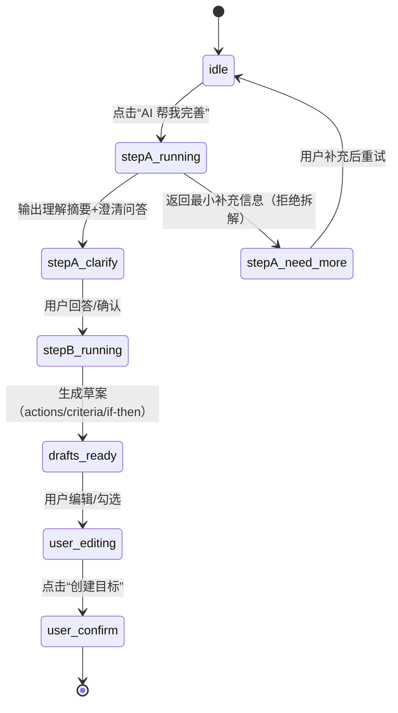

# PRD - Phase 2A：AI Daily Coach（Today Plan/Rescue/Review）+ Goal Setup AI v1

## 概述
- **背景**：当前 AI 主要出现在“创建目标”这一低频环节，容易被感知为一次性新奇；需要把 AI 嵌入 Today/执行/复盘的高频闭环，形成每日仪式，从而提升 D7/D30 留存。
- **目标（两周 MVP）**：
  - 让用户每天在 Today 里 1 次点击获得“可执行下一步”（Plan/Rescue/Review 三入口）。
  - 在创建目标时用“两阶段（先澄清→再拆解）”降低“随意感”，并补齐成功/放弃标准草案。
  - 所有 AI 产出均为“草案”，用户确认后才落库；不用 AI 也能完整走原流程。
- **用户价值**：
  - 降低启动摩擦：不用想“下一步做什么”，有一个最小可做的动作。
  - 降低失败羞耻：卡住时能降难度、能恢复连续性。
  - 降低决策疲劳：仅给 1 个核心行动 + 最多 2 个备选，提供 5/10/20 分钟三档。
- **范围**（本 PRD）：
  - Goal Setup AI：理解摘要 + 2–3 问澄清 + 行动/标准/If-Then 草案。
  - Daily Coach AI：Today Plan / 执行 Rescue / 夜间 Review。
  - 事件埋点：触发/采纳/完成/次日回流相关事件字典。
- **不做什么（MVP 不包含）**：
  - 自动弹窗/强提醒（仅按钮入口；连续 2 天未完成仅轻提示 1 次）。
  - Quest/Boss 微挑战与强游戏化奖励（作为后续增值层）。
  - 个性化 RAG/向量检索（先用现有结构化字段 + 最近行为摘要）。

## 功能

### 1) Goal Setup AI（低频但认真）
#### 1.1 入口与定位
- 入口：新建目标页（现有表单）新增 “AI 帮我完善并拆解（草案）” 按钮，位于描述/日期/成功标准区域附近。
- 定位：不替用户做决策；只把“长背景”变成结构化 Goal Brief，并补齐成功/放弃标准草案，再生成可执行行动草案。

#### 1.2 输入与字段对齐（现有系统）
- Goals 表已存在字段：
  - `success_criteria`（成功标准，text）
  - `stop_criteria`（放弃/止损标准，text）
- Actions 表承载“核心行动”概念：
  - `type='core'` 表示核心行动（用于 Dashboard/Today 的聚焦逻辑）

#### 1.3 交互流程（两阶段）
- Step A：理解摘要 + 最小澄清（2–3 问）
  - 输出块（先展示，提升“显性理解”）：目标 1–2 句、关键约束 2–3 点、最大阻力 1–2 点、建议杠杆点 1 点。
  - 澄清问题：尽量单选/短答（例如：主要结果类型、每日可投入时间档、成功标准偏好）。
  - 质量门槛：若关键输入不足，AI 仅返回“需要补充的最小信息 2–3 条”，不进入拆解。
- Step B：生成草案（用户可编辑/勾选，确认后才落库）
  - 行动草案（Actions）：6–10 个，单个行动 5–20 分钟，标题动词开头，每条含“为何是这一步 + DoD（完成定义）”。
  - 成功标准草案（Success Criteria）：≥2 条（至少 1 条结果型 + 1 条过程型）。
  - 放弃/止损标准草案（Stop/Abandon Criteria）：≥2 条（资源触发 + 方向触发）。
  - If-Then：选择 1–2 个最可能阻力，给出触发条件与最小替代行动。

#### 1.4 状态机（UI/后端一致）

#### 1.5 失败策略（必须硬执行）
- 信息不足：不输出行动列表，仅给 2–3 个最小澄清项。
- 输出不合格：若行动无法满足“5–20 分钟 + 动词开头 + 可验收”，必须自动自检并重写（仍失败则提示用户改写目标/拆小范围）。
- 用户不想回答问题：允许“先给一个保守版本（3 条行动 + 2 条标准）”，但必须标注“低确信度草案”。

---

### 2) Daily Coach AI（高频留存核心）

#### 2.1 Today Plan：一键生成今日核心行动
- **入口**：Dashboard 的 “DailyPlanningCard” 中新增按钮 “AI 给我一个今日核心行动（草案）”。
- **输入**（MVP：无需新表，优先复用现有数据）：
  - 活跃目标列表（含优先级、截止日期、成功/止损标准文本）
  - 最近一周完成率（可用 actions.completed + daily score 粗略估算）
  - 昨日/近期阻力（MVP 先用用户选择的阻力标签；若未实现则为空）
- **输出**：
  - 今日核心行动（1 个）+ 备选（最多 2 个）
  - 三档难度（5/10/20 分钟）：同一意图的不同粒度版本
  - 极短理由（1 句）
- **落库规则**：
  - 默认不自动创建 action；用户选择某一档并确认后，创建 `actions` 记录，且 `type='core'`。
  - 如果用户已有 `type='core'` 的今日核心行动：入口可变为“AI 帮我调难度/换方案（草案）”，但仍要求用户确认。

#### 2.2 执行 Rescue：卡住时降难度救援
- **入口**：Today/仪表盘聚焦卡的核心行动上新增 “我卡住了/太难/没时间”。
- **输出**：
  - 5 分钟最小版本（保连续性）
  - If-Then（本次卡点触发→最小替代）
  - 开始脚本（第一步是什么 + 准备清单）
- **落库规则**（MVP 简化）：
  - 用户可选择 “替换当前行动标题/描述” 或 “新增一个最小行动（type=core 或 maintenance）”。

#### 2.3 夜间 Review：两问复盘 → 明日防翻车卡
- **入口**：Dashboard/Today 的评分区域新增 “AI 帮我总结今天 & 给明天策略（草案）”。
- **交互**：最多 2 问（优先选择题）；允许用户直接跳过问题但仍生成“低确信度”总结。
- **输出**：
  - 今日一句总结
  - 明日防翻车卡（基于阻力标签或用户回答）
  - 建议的“明日核心行动”方向（不自动落库）

#### 2.4 不打扰策略
- 默认：仅按钮入口，不自动弹出。
- 轻提示：若连续 2 天未完成核心行动，可在 Dashboard 顶部显示一次轻提示 “要不要生成 5 分钟版本？”（可关闭）。

## 非功能性
- **性能**：
  - Today Plan/Rescue/Review：以短输出为主；UI 需有 loading 与超时重试。
  - 若 AI 响应超时：回退为“非 AI 模式”提示（引导手动设置核心行动）。
- **可靠性**：
  - 所有 AI 调用必须可取消；失败不影响正常创建/勾选 action。
  - 输出必须通过质量校验（见《AI 输出 Schema 与质量门槛》文档）。
- **安全与隐私**：
  - 不在日志中记录用户输入全文；埋点 payload 仅存 id/枚举/长度等脱敏信息。
  - 明确告知：AI 产出仅为草案，用户为最终决策者。

## 验收标准
### 1) 用例清单（两周 MVP）
- 新建目标：点击 AI → 先看到理解摘要 + 2–3 个澄清问题 → 回答后生成行动/成功/止损/If-Then 草案 → 用户编辑后创建目标成功。
- 新建目标：输入不足 → AI 仅返回需要补充的最小信息 → 不生成行动列表。
- Dashboard：无核心行动时 → 可一键用 AI 生成核心行动草案 → 用户确认后创建 `type='core'` action → FocusCard 正常展示。
- Today/Focus：对核心行动点击 Rescue → 生成 5 分钟版本/If-Then/开始脚本 → 用户选择“替换”或“新增”后可立即执行。
- Review：点击复盘 → 最多 2 问 → 输出一句总结 + 明日防翻车卡 → 不强制落库。

### 2) 边界条件
- 用户未登录/会话过期：AI 按钮不可用或提示登录；不影响普通流程。
- 用户已有多个核心行动：Plan 提示“建议只保留 1 个”，并默认推荐替换而非新增。
- 目标/行动归档：不作为 Plan 候选。

### 3) 埋点字典（MVP）
说明：当前项目已有 `logEvent(name, payload?)`（浏览器 console 占位）。事件名沿用 `snake_case`，payload 仅包含必要字段（避免敏感文本）。

| 事件名 | 触发时机 | payload（示例） |
| --- | --- | --- |
| `ai_goal_setup_click` | 新建目标点击 AI | `{ source: 'new_goal', has_desc: true, desc_len: 420 }` |
| `ai_goal_setup_stepA_success` | StepA 输出理解摘要 | `{ questions: 3 }` |
| `ai_goal_setup_stepA_need_more` | StepA 拒绝拆解 | `{ missing: ['success_definition','time_budget'] }` |
| `ai_goal_setup_stepB_success` | StepB 生成草案 | `{ actions: 8, has_if_then: true }` |
| `ai_goal_setup_apply` | 用户确认应用草案创建目标 | `{ applied_actions: 6, edited: true }` |
| `ai_today_plan_click` | Today Plan 点击 | `{ source: 'dashboard' }` |
| `ai_today_plan_suggested` | Plan 返回建议 | `{ options: 3 }` |
| `ai_today_plan_apply` | 用户选择某档并落库 | `{ option: '10m', goal_id: '...' }` |
| `ai_rescue_click` | Rescue 点击 | `{ action_id: '...', reason: 'too_hard' }` |
| `ai_rescue_apply` | Rescue 方案被应用 | `{ mode: 'replace', option: '5m' }` |
| `ai_review_click` | Review 点击 | `{ source: 'dashboard', had_score: true }` |
| `ai_review_generated` | Review 输出生成 | `{ questions_answered: 2 }` |
| `ai_review_dismiss` | Review 关闭未采纳 | `{ step: 'result' }` |

