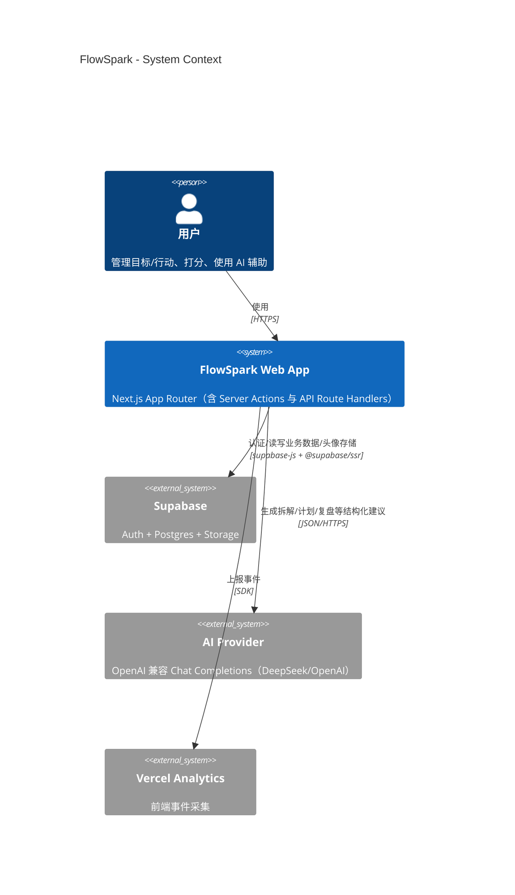
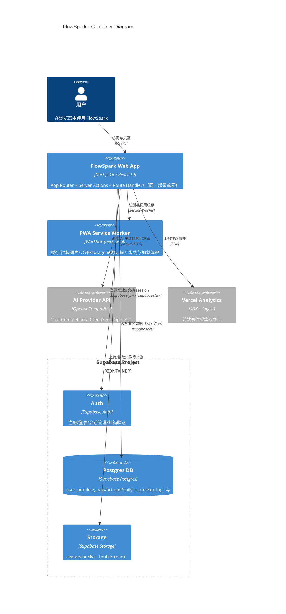

# 技术架构 C4 图（现状）

## 1) C4-Context（系统上下文）

## 2) C4-Container（容器图）

## 3) 对应代码入口
- Web App（页面/布局）：`../../src/app/*`
- Server Actions：`../../src/app/(authenticated)/**/actions.ts`
- API Route Handlers：`../../src/app/api/**/route.ts`
- PWA 缓存策略：`../../next.config.ts` 的 `runtimeCaching`
- Supabase client/middleware：`../../src/lib/supabase/*`
- AI Provider：`../../src/lib/ai/client.ts`
- Analytics：`../../src/lib/analytics.ts`
