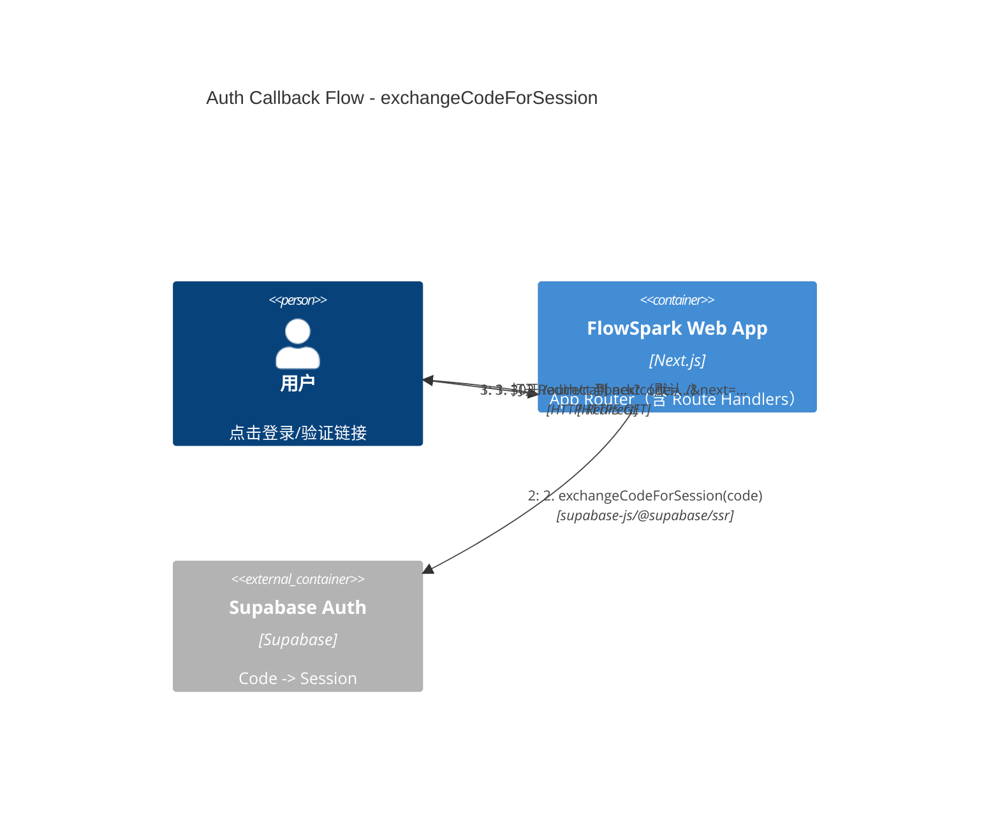
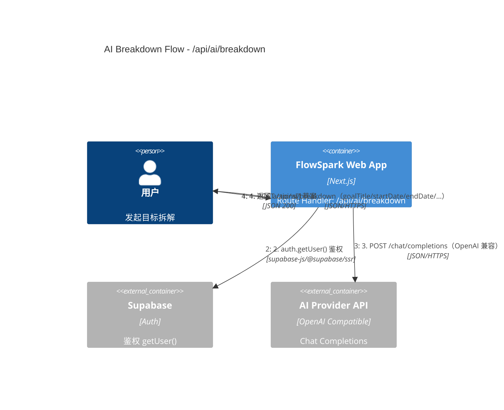

# 关键流程（Auth 与 AI）

## 1) 登录回调：`/auth/callback` 交换 session 并重定向

实现入口：
- 回调处理：`../../src/app/auth/callback/route.ts`
- 路由保护与 session 刷新：`../../middleware.ts` + `../../src/lib/supabase/middleware.ts`

关键行为（现状）：
- 受保护路由（`/dashboard|/goals|/profile|/today`）未登录会被 middleware 重定向到 `/login`
- 受保护路由强制邮箱已验证（`email_confirmed_at`），否则重定向到 `/login?error=...`
- refresh token 异常时会清理 Supabase 相关 cookie 并按未登录处理

## 2) AI 拆解：`POST /api/ai/breakdown` 生成行动草案

实现入口：
- 路由：`../../src/app/api/ai/breakdown/route.ts`
- 业务逻辑：`../../src/lib/ai/breakdown.ts`
- Provider 调用：`../../src/lib/ai/client.ts`

错误映射（现状）：
- 入参/日期范围等校验失败：400
- 缺少 AI Key：500（`missing_ai_key`）
- provider/网络类失败：502（例如 `ai_provider_error`、`empty_ai_response` 等）
