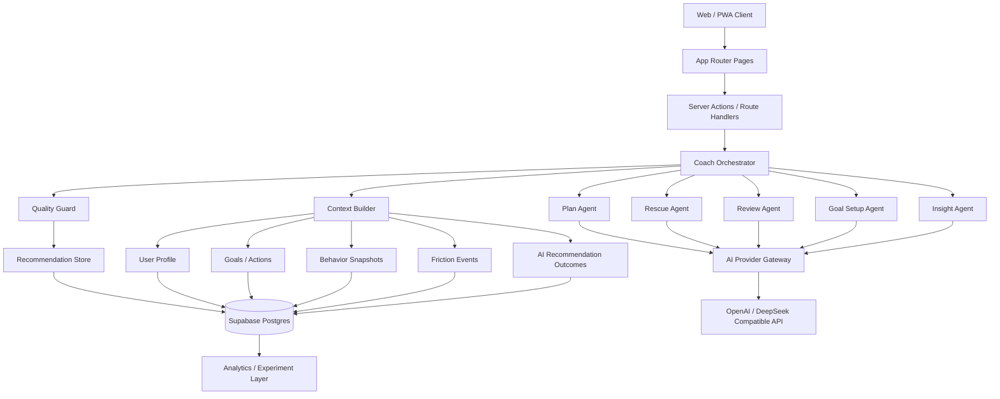
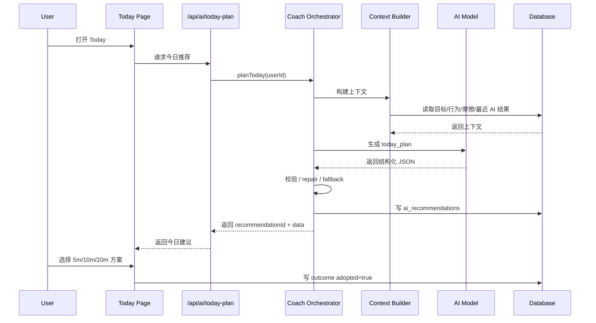

# 技术 - 20 AI原生系统架构设计 v1

## 1. 文档目标

本文基于当前 `FlowSpark` 仓库现状，给出一版面向 AI 时代的系统升级方案。目标不是为现有系统“外挂几个 AI 功能”，而是将产品升级为一个具备：

- 持续理解用户状态
- 主动编排每日推进节奏
- 记录建议效果并自我优化
- 支撑增长实验与商业化验证

的 AI 原生个人成长系统。

本文重点覆盖：

- AI 时代下的产品与系统目标
- 目标架构与模块边界
- 数据模型扩展方案
- 核心接口与编排流程
- 分阶段实施路线图
- 风险、护栏与指标体系

---

## 2. 现状与问题定义

### 2.1 当前系统现状

当前仓库已经具备以下基础：

- 前端与服务端同仓：`Next.js App Router`
- 数据与认证：`Supabase Auth + Postgres + RLS`
- AI 路由：`/api/ai/breakdown`、`/api/ai/goal-setup/*`、`/api/ai/today-plan`、`/api/ai/rescue`、`/api/ai/review`、`/api/ai/potential`
- 产品主链路：`Goal -> Action -> Today -> Review -> Dashboard`
- 轻量实验与埋点：`logEvent()` + Vercel Analytics

这说明系统已经进入“AI 增强型 SaaS”阶段，但尚未形成“AI 原生系统”。

### 2.2 当前主要问题

从产品与架构角度，当前仍存在以下瓶颈：

1. **AI 能力是点状功能，不是统一系统**
   - 各 AI 路由独立工作，缺少统一策略层、上下文拼装层、结果记录层。

2. **缺少长期用户记忆**
   - 目前主要依赖即时上下文与 `ai_recent_events`，无法形成真正个性化的长期判断。

3. **缺少建议结果闭环**
   - 系统知道“生成了什么”，但还不够知道“什么建议被采纳、完成、复访更高”。

4. **Today 还不是绝对中心**
   - 产品仍偏“目标管理工具”，没有完全转向“每日 AI 教练”。

5. **实验能力偏轻**
   - 当前可观测基础存在，但还缺少 AI 建议级别的质量归因与模型/提示词版本归因。

### 2.3 升级目标

系统升级的目标不是让 AI “更会说”，而是让它：

- 更快替用户做决策
- 更稳定推动用户开始行动
- 更好帮助用户在低能量状态下保持连续性
- 更准确识别什么策略对这个用户有效

---

## 3. 总体设计原则

### 3.1 产品原则

- **默认给答案，不让用户面对空白页**
- **优先降低启动摩擦，而不是增加规划自由度**
- **优先保连续性，而不是追求一次做很多**
- **把 AI 做成“节奏管理者”，不是“内容生成器”**

### 3.2 架构原则

- **编排统一**：AI 调用必须走统一编排层，避免逻辑散落
- **上下文标准化**：所有 AI 请求使用统一上下文结构
- **结果可追踪**：所有建议必须可记录、可回放、可分析
- **失败可降级**：AI 异常时仍有可靠 fallback，不阻断核心产品流程
- **与现有系统兼容演进**：优先在当前 `Next.js + Supabase` 基础上扩展，而不是整体重构

### 3.3 数据原则

- **结构化优先，向量化递进**
- **先解决推荐闭环，再追求复杂 Agent**
- **先做用户状态快照，再做复杂长期记忆**

---

## 4. 目标系统定位

### 4.1 产品定位

建议将系统定位从“目标管理工具”升级为：

- AI Growth Coach
- AI Personal Momentum System
- 帮用户持续推进长期目标的 AI 教练系统

### 4.2 北极星价值

系统不再只是帮助用户记录目标，而是帮助用户：

- 每天更快进入行动
- 在掉线时更快回到轨道
- 感受到系统越来越懂自己

### 4.3 核心闭环

目标架构围绕以下高频闭环建立：

1. 用户设定长期目标
2. AI 生成今日最值得推进的一步
3. 用户遇阻时 AI 自动救援并降级任务
4. 完成后系统记录结果与奖励
5. 晚间 AI 极简复盘并生成明日防失败策略
6. 系统根据历史结果调整下一轮推荐

---

## 5. 目标架构

## 架构图



### 5.1 分层说明

#### 体验层

- `Landing / Dashboard / Today / Goals / Inbox / Profile`
- 核心升级方向：让 `Today` 成为主入口与最高频页面

#### 应用层

- 由 `App Router` 页面、Server Actions、Route Handlers 构成
- 继续沿用当前项目结构，不要求大规模目录重组

#### 编排层

- 新增统一的 `Coach Orchestrator`
- 负责：
  - 决定调用哪个 AI Agent
  - 拉取并标准化上下文
  - 执行规则判断
  - 调用模型
  - 做输出校验与失败兜底
  - 记录建议与效果

#### Agent 层

- `Goal Setup Agent`
- `Today Plan Agent`
- `Rescue Agent`
- `Review Agent`
- `Insight Agent`

每个 Agent 只关心自己的输入与输出 schema，不负责全局策略与持久化。

#### 数据层

- 继续使用 `Supabase Postgres`
- 以结构化表和快照表支撑 AI 决策
- 后续可追加 `pgvector` 作为增强记忆层

#### 实验与分析层

- 埋点、建议采纳、完成、回流、提示词版本与模型版本归因
- 支撑功能灰度、A/B 实验与效果分析

---

## 6. 核心模块设计

## 交互机制

### 6.1 Today 作为 AI 主战场

`Today` 页面升级为产品真正的首页，承担：

- 展示今日推荐核心行动
- 提供 5/10/20 分钟变体
- 在未启动时提供“直接开始”
- 在中断时提供“救援模式”
- 在结束时引导极简复盘

#### 页面原则

- 默认有一个 AI 推荐，不让用户先填表
- 页面默认强调“今天做什么”，而不是“有哪些目标”
- 用户操作尽量压缩到 1-2 次点击

### 6.2 Coach Orchestrator

建议新增：

- `src/lib/ai/coachOrchestrator.ts`

职责拆分如下：

- `buildCoachContext(scene, userId)`
- `decideStrategy(scene, context)`
- `invokeAgent(scene, context, strategy)`
- `validateAndRepair(output)`
- `persistRecommendation(input, output)`
- `persistOutcome(recommendationId, outcome)`

推荐接口形态：

```ts
type CoachScene = 'goal_setup' | 'today_plan' | 'rescue' | 'review' | 'weekly_insight'

type CoachResult<T> = {
  recommendationId: string
  scene: CoachScene
  strategyVersion: string
  promptVersion: string
  model: string
  output: T
  confidence: 'low' | 'medium' | 'high'
}
```

### 6.3 Context Builder

建议新增：

- `src/lib/ai/contextBuilder.ts`

统一输出以下上下文结构：

```ts
type CoachContext = {
  identity: {
    userId: string
    locale: 'zh' | 'en'
    timezone: string
  }
  profile: {
    primaryGoalArea?: string | null
    preferredTimeBucket?: string | null
    motivationStyle?: string | null
    difficultyTolerance?: string | null
  }
  goals: Array<{
    id: string
    title: string
    priority: string | null
    status?: string | null
    startDate?: string | null
    endDate?: string | null
  }>
  behavior: {
    completionRate7d?: number | null
    completionRate30d?: number | null
    scoreAvg7d?: number | null
    momentumBucket?: 'high' | 'medium' | 'low' | 'unknown'
  }
  frictions: Array<{
    reasonTag: string
    count: number
    lastOccurredAt: string
  }>
  recentAI: Array<{
    scene: string
    adopted: boolean | null
    completed: boolean | null
  }>
}
```

### 6.4 Quality Guard

当前已有结构化输出与单次 repair 机制，建议继续增强，不替换现有方案：

- 保留当前 schema 校验
- 增加建议质量标签
- 区分“模型输出失败”和“策略选择错误”

建议新增质量分层：

- `schema_valid`
- `actionability_score`
- `adoption_ready`
- `requires_fallback`

### 6.5 Insight Agent

新增一个非高频但高价值的 Agent：

- 周度或阶段性总结
- 识别用户常见中断原因
- 输出“你最近更适合怎样的任务粒度/节奏”

这类能力更适合做留存与高阶付费价值，不建议先放在主流程里。

---

## 7. 数据模型扩展

## 数据模型

### 7.1 保留现有核心表

继续使用现有：

- `user_profiles`
- `goals`
- `actions`
- `daily_scores`
- `xp_logs`
- `potential_sessions`

### 7.2 新增表一：`user_growth_profiles`

用途：保存用户长期画像，供 Today/Review/Insight 读取。

建议字段：

```sql
create table user_growth_profiles (
  user_id uuid primary key references auth.users(id) on delete cascade,
  primary_goal_area text,
  motivation_style text,
  preferred_time_bucket text,
  difficulty_tolerance text,
  risk_of_dropout text,
  current_stage text,
  summary text,
  updated_at timestamptz not null default now()
);
```

说明：

- 存长期稳定或缓慢变化的信息
- 不适合承载高频行为明细

### 7.3 新增表二：`user_behavior_daily_snapshots`

用途：为 AI 决策提供高频聚合结果，避免每次现场计算。

建议字段：

```sql
create table user_behavior_daily_snapshots (
  id uuid primary key default gen_random_uuid(),
  user_id uuid not null references auth.users(id) on delete cascade,
  snapshot_date date not null,
  actions_created int not null default 0,
  actions_completed int not null default 0,
  core_actions_completed int not null default 0,
  completion_rate numeric,
  daily_score int,
  momentum_bucket text,
  active_time_bucket text,
  created_at timestamptz not null default now(),
  unique (user_id, snapshot_date)
);
```

说明：

- 面向近 7/30/90 天聚合分析
- 可由定时任务或写操作后增量更新

### 7.4 新增表三：`user_friction_events`

用途：记录用户中断与困难模式。

建议字段：

```sql
create table user_friction_events (
  id uuid primary key default gen_random_uuid(),
  user_id uuid not null references auth.users(id) on delete cascade,
  goal_id uuid references goals(id) on delete set null,
  action_id uuid references actions(id) on delete set null,
  scene text not null,
  reason_tag text not null,
  detail text,
  created_at timestamptz not null default now()
);
```

说明：

- Rescue、Review、未完成后的降级操作都可以写入
- 未来可用于识别“最常见掉线模式”

### 7.5 新增表四：`ai_recommendations`

用途：保存每一次 AI 建议，以便可追踪、可审计、可回放。

建议字段：

```sql
create table ai_recommendations (
  id uuid primary key default gen_random_uuid(),
  user_id uuid not null references auth.users(id) on delete cascade,
  scene text not null,
  strategy_version text not null,
  prompt_version text not null,
  model text not null,
  input_summary jsonb,
  output_payload jsonb not null,
  confidence text,
  status text not null default 'generated',
  created_at timestamptz not null default now()
);
```

说明：

- 存输入摘要，不建议全量存 prompt 原文
- `output_payload` 直接保存 schema JSON

### 7.6 新增表五：`ai_recommendation_outcomes`

用途：记录 AI 建议最终有没有被采纳和完成。

建议字段：

```sql
create table ai_recommendation_outcomes (
  id uuid primary key default gen_random_uuid(),
  recommendation_id uuid not null references ai_recommendations(id) on delete cascade,
  user_id uuid not null references auth.users(id) on delete cascade,
  adopted boolean,
  option_selected text,
  completed boolean,
  completion_minutes int,
  feedback_label text,
  created_at timestamptz not null default now()
);
```

说明：

- `option_selected` 可记录 `5m | 10m | 20m`
- 是实验分析与模型优化的关键表

### 7.7 可选表六：`coach_memory_chunks`

用途：后续做 embedding 与个性化检索。

建议字段：

```sql
create table coach_memory_chunks (
  id uuid primary key default gen_random_uuid(),
  user_id uuid not null references auth.users(id) on delete cascade,
  memory_type text not null,
  content text not null,
  source_ref text,
  embedding vector(1536),
  created_at timestamptz not null default now()
);
```

说明：

- 这是 Phase 2 之后再加的增强层
- MVP 不强依赖它

---

## 8. 核心接口设计

### 8.1 推荐保留的现有接口

现有以下接口可以继续保留，并逐步迁移到统一编排层内部：

- `/api/ai/goal-setup/step-a`
- `/api/ai/goal-setup/step-b`
- `/api/ai/today-plan`
- `/api/ai/rescue`
- `/api/ai/review`

### 8.2 推荐新增的服务抽象

不要继续新增零散 route，而是在服务层新增统一入口：

- `src/lib/ai/coachOrchestrator.ts`
- `src/lib/ai/contextBuilder.ts`
- `src/lib/ai/recommendationStore.ts`
- `src/lib/ai/strategy.ts`

### 8.3 推荐接口返回约定

所有 AI 结果统一包装：

```ts
type CoachApiResponse<T> = {
  ok: boolean
  recommendationId?: string
  scene: string
  data?: T
  confidence?: 'low' | 'medium' | 'high'
  fallbackUsed?: boolean
  errorCode?: string
}
```

### 8.4 建议结果写入时机

#### 建议生成时

- 写 `ai_recommendations`

#### 用户选择某个方案时

- 写 `ai_recommendation_outcomes.adopted = true`
- 记录选择的 `5m/10m/20m`

#### 用户最终完成时

- 补写 `completed = true`
- 同步写业务动作完成逻辑

#### 用户放弃时

- 可记录 `feedback_label = dismiss`

---

## 9. 关键流程设计

### 9.1 Today Plan 流程



### 9.2 Rescue 流程

触发条件建议包括：

- 用户点“做不动”
- 用户超时未开始
- 用户连续两次未完成核心行动

核心目标：

- 不是重新规划，而是立即给最小可行动版本

### 9.3 Review 流程

触发条件：

- 晚间评分后
- 今日核心行动完成后

输出原则：

- 一句话总结
- 一张明日防翻车卡
- 可写入摩擦事件

### 9.4 Weekly Insight 流程

每周生成：

- 本周推进模式
- 高完成率时间段
- 最常见失败原因
- 下周推荐节奏

这类结果更适合做周报卡片或付费增强功能。

---

## 10. 技术落地建议

## 技术栈

### 10.1 继续沿用的技术栈

- 前端：`Next.js App Router + React + Tailwind`
- 后端：`Route Handlers + Server Actions`
- 数据库：`Supabase Postgres + RLS`
- AI 接入：保留当前 OpenAI Compatible Gateway
- 观测：Vercel Analytics + 自定义埋点

### 10.2 代码组织建议

建议在 `src/lib/ai/` 目录下新增：

```text
src/lib/ai/
├── coachOrchestrator.ts
├── contextBuilder.ts
├── recommendationStore.ts
├── strategy.ts
├── insights.ts
├── phase2a.ts
├── phase2aSchemas.ts
└── phase2aQuality.ts
```

建议在 `src/lib/` 下新增：

```text
src/lib/
├── experiments.ts
├── analytics.ts
├── userState.ts
└── snapshots.ts
```

### 10.3 定时任务建议

建议增加两个周期性任务：

1. 每日快照任务
   - 汇总 `user_behavior_daily_snapshots`

2. 每周洞察任务
   - 生成周度 insight 草稿或画像更新

若暂不引入调度系统，可先用：

- Vercel Cron
- Supabase Scheduled Functions

---

## 11. 指标与实验体系

### 11.1 北极星指标

推荐使用：

- `WAU 中完成 >= 1 个核心行动的用户占比`

原因：

- 比“生成了建议”更接近真实用户价值
- 能覆盖 Plan、Rescue、Review 的整体闭环效果

### 11.2 核心转化漏斗

建议统一为：

1. 建议曝光
2. 建议点击
3. 建议采纳
4. 行动完成
5. 次日回流
6. 7 日留存

### 11.3 关键事件

- `ai_today_plan_exposed`
- `ai_today_plan_click`
- `ai_today_plan_apply`
- `ai_rescue_click`
- `ai_rescue_apply`
- `ai_review_click`
- `ai_review_generated`
- `ai_review_dismiss`
- `ai_weekly_insight_view`

### 11.4 护栏指标

- create/update action 失败率
- AI 接口超时率
- AI 输出校验失败率
- 页面响应时间
- 建议曝光后的立即退出率

### 11.5 版本归因

建议在 `ai_recommendations` 中记录：

- `strategy_version`
- `prompt_version`
- `model`

确保后续可以回答：

- 是哪个 prompt 更有效？
- 是哪个模型组合更稳定？
- 是策略问题还是模型问题？

---

## 12. 分阶段实施路线图

### Phase A：闭环打通（1-2 周）

目标：把现有 AI 功能串成稳定日循环。

实施项：

- Today 页面默认展示 AI 核心行动
- 统一记录 AI 建议与采纳结果
- 打通 5/10/20 方案采纳链路
- 补充 Rescue 与 Review 的 outcome 埋点

验收标准：

- Today 建议可追踪
- 采纳率、完成率可观测
- 不影响原有非 AI 路径

### Phase B：统一编排（2-3 周）

目标：把零散 AI 路由整合为统一策略层。

实施项：

- 新增 `Coach Orchestrator`
- 新增 `Context Builder`
- 抽离 recommendation store
- 统一错误处理与 fallback

验收标准：

- Today/Rescue/Review 至少 3 个场景走统一编排
- 同类逻辑不再散落在多个 route 中重复实现

### Phase C：用户记忆（2-4 周）

目标：让 AI 更懂用户并支持更稳定个性化。

实施项：

- 新增 growth profile / daily snapshots / friction events
- 形成用户状态聚合读取接口
- 用快照支持 Today 决策

验收标准：

- Today 推荐不再只依赖即时数据
- 能识别高/中/低动量用户并差异化推荐

### Phase D：主动式教练（后续）

目标：从响应式建议进入主动式陪跑。

实施项：

- 周度 insight
- 主动纠偏建议
- 护盾机制
- 更深的实验系统

---

## 13. 风险与护栏

### 13.1 主要风险

#### 风险一：AI 功能很多，但使用频率不高

应对：

- 聚焦 Today 闭环
- 控制入口数量
- 优先做默认推荐而不是更多按钮

#### 风险二：推荐看起来聪明，但完成率不高

应对：

- 建立 outcome 表
- 用完成率反推建议质量

#### 风险三：模型输出波动导致体验不稳定

应对：

- 继续强化 schema 校验
- 保留单次 repair
- 提供规则 fallback

#### 风险四：数据模型过快复杂化

应对：

- 先做结构化表
- 把向量记忆推迟到有明确收益后再上

#### 风险五：AI 成本增长过快

应对：

- 优先高价值场景调用
- 控制上下文长度
- 把低价值总结用规则逻辑兜底

---

## 14. 推荐的近期代码改造清单

### 14.1 第一批必做

- 新增 `src/lib/ai/coachOrchestrator.ts`
- 新增 `src/lib/ai/contextBuilder.ts`
- 新增 `src/lib/ai/recommendationStore.ts`
- 新增 `ai_recommendations` 表
- 新增 `ai_recommendation_outcomes` 表
- Today 页面接入 recommendationId 链路

### 14.2 第二批应做

- 新增 `user_behavior_daily_snapshots`
- 新增 `user_friction_events`
- Rescue / Review 补齐结果追踪

### 14.3 第三批增强

- 新增 `user_growth_profiles`
- 新增 `weekly_insight`
- 引入更明确的实验分流与版本控制

---

## 15. 最终结论

当前系统最正确的升级方向不是“增加更多 AI 功能页”，而是围绕 `Today` 建立一个可持续优化的 AI 教练闭环。

建议优先聚焦以下三件事：

1. **让 Today 成为默认 AI 决策入口**
2. **让所有 AI 建议都可追踪、可分析、可优化**
3. **让系统逐步具备对用户的长期记忆与阶段判断**

当以上三件事完成后，FlowSpark 才会真正从“有 AI 的目标管理工具”，升级为“AI 原生的成长操作系统”。
